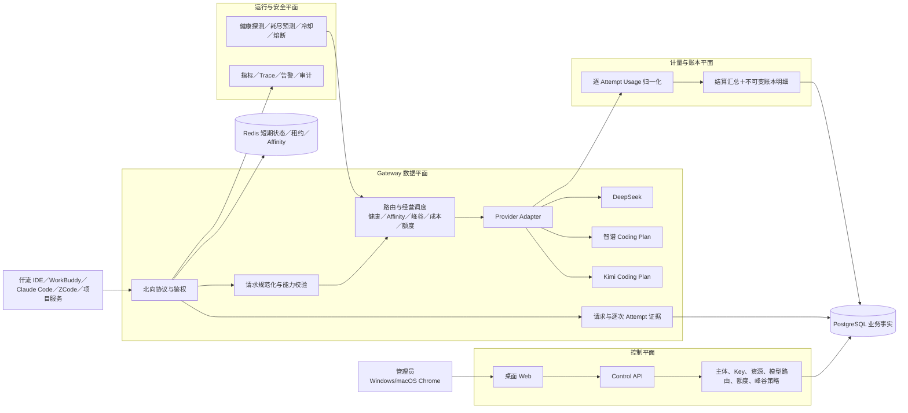

# 仟流智算技术需求文档

| 项目 | 内容 |
| --- | --- |
| 产品名称 | 仟流智算 |
| 文档版本 | v0.3 |
| 更新时间 | 2026-07-26 |
| 技术负责人 | 佳哥 |
| 适用阶段 | Stage 01 方案准备 |
| 当前状态 | Stage 01 技术方案已通过；Node／TypeScript 独立实现、持久化闭环与协议边界已冻结 |
| 产品需求基线 | [《仟流智算产品需求文档 v0.3》](./仟流智算-产品需求文档-v0.3.md) |
| 产品架构基线 | [《仟流智算产品架构图 v0.3》](./仟流智算-产品架构图-v0.3.html) |
| 唯一技术权威 | 本文 |

> **技术最高约束**
>
> API、Coding Plan 和账号池资源在仟流内部统一落为 Token 用量事实。输入、输出、缓存等 Token 分项是所有额度、扣减、费用、预测和调度的共同底座；不同模型、资源和 Token 类型的倍率与价值通过版本化规则表达，不得因统一基础单位而丢失差异。
>
> 所有技术模块必须追溯到“持续生产、按量消耗、存在峰谷差异、必须计量和调度”四个核心性质，或作为其安全、隐私、可靠性横向约束。完整闭环统一为：
>
> `数据输入 → 确定性判断 → 执行动作 → 结果落账 → 可解释查询 → 对账修正`
>
> 健康路由只解决技术可用性，不能替代峰谷、成本、额度和剩余周期驱动的经营调度；请求级幂等只防重复结算，不能抹掉任何实际 Attempt 的真实消耗。

## 1. 技术目标

在当前阶段默认不采集员工电脑内容、不把上游真实凭证交给员工的前提下，建立以企业 AI Gateway 为核心的数据平面，并与 Token、资源管理、额度和账本形成闭环：

1. 识别员工或项目；
2. 规范化 OpenAI／Anthropic 请求并按 Provider 能力显式校验；
3. 校验模型权限、Key 限制、额度和并发；
4. 按模型路由、健康、优先级、权重和 Session Affinity 选择资源；
5. 在流式提交边界内完成转发、重试、故障切换和取消传播；
6. 记录请求、每次上游尝试、输入／输出／缓存 Token、额度扣减和实际费用；
7. 保证一次业务请求只有一个幂等结算汇总，同时保留每个真实消耗 Attempt 的明细；
8. 为桌面 Web 提供可查询、可解释的资源、路由和账本数据。

其中第 7 项的准确含义是“一次业务请求只有一个幂等结算汇总”。每个实际访问上游且产生可证明用量的 Attempt，仍必须形成独立用量事实和账本明细。

### 1.1 四个核心性质的技术闭环

| 核心性质 | 数据输入 | 判断与动作 | 结果证据 |
| --- | --- | --- | --- |
| 持续生产 | 余额、周期、健康、消耗速度 | 预测耗尽／恢复；切换、限流或告警 | 供给快照、预测偏差、资源状态事件 |
| 按量消耗 | 主体、Key、Attempt Token、价格／倍率 | 归因、预占、结算、超额控制 | Token 事实、请求汇总、逐 Attempt 明细、对账差异 |
| 存在峰谷差异 | 时间、时区、价格版本、扣减倍数、剩余周期 | 形成请求前成本快照；受控切换、限流或拒绝 | 命中规则、动作、反事实基线和可证明节省 |
| 必须计量和调度 | 权限、额度、并发、候选资源、经营策略 | 放行、切换、限流、拒绝、允许超额 | 决策记录、路由证据、账本和审计 |

## 2. 技术边界

### 2.1 仟流智算负责

- 企业、团队、员工和项目的领域边界；一期仅启用单企业管理员和员工登录；
- 员工／项目统一使用主体；
- 下游虚拟 Key；
- 上游资源账号和凭证；
- OpenAI／Anthropic 兼容 Gateway 数据平面，以及目标协议矩阵和 SSE／WebSocket 传输契约；
- Provider 能力注册、Unified Model 和 Model Route；
- DeepSeek、智谱、Kimi 上游适配；
- API Key／OAuth／套餐账号池、凭证刷新、健康探测、多因子评分、Session Affinity 和有界故障切换；
- 消耗速度、耗尽／恢复预测和供给覆盖快照；
- 峰谷、价格／倍率、额度稀缺和剩余周期驱动的经营调度；
- 请求级路由日志、上游尝试和流式提交边界；
- 下游 Key 的模型、来源 IP、有效期、额度和并发限制；
- 额度、分时价格和扣减规则；
- 用量账本、费用和异常；
- 桌面 Web。

仟流的目标客户是企业用户及其团队。一期单企业内部验证是部署和交付阶段约束，不得把领域模型写死为“永远只服务仟流科技”。`enterprise_id` 必须贯穿主体、资源授权、策略、账本和审计；团队、成本中心、分级 RBAC 与企业身份源可以后续启用，但当前 Schema 和 API 边界不得阻断演进。

### 2.2 仟流 Platform 和仟流 IDE

- 仟流 IDE 是一期员工客户端之一。
- 仟流 IDE 通过现有 Model Gateway 接入仟流智算，不复制智算领域逻辑。
- 仟流 Platform 的通用 Agent、任务、Skill、权限和知识能力不属于一期智算服务器热路径。
- 二期仟流智算 Agent 通过智算公开管理 API 工作；一期只预留入口和接口边界。

### 2.3 一期不建设

- 终端采集程序；
- 网络透明代理；
- 移动端；
- 外部通知适配器；
- 多企业管理界面；
- 员工任务到项目的动态费用归属；
- 自动解析厂商网页并更新价格；
- 保存模型调用正文；当前默认零留存，未来如有企业明确需求必须通过独立安全方案启用。
- 跨区域多活和外部租户分级 RBAC；
- 未经 PoC 证明有真实客户端需求的协议端点。

## 3. 总体架构



### 3.1 部署形态

一期采用模块化单体加独立 Gateway 进程：

- `web`：React 桌面 Web；
- `control-api`：登录、资源、主体、额度、查询和操作日志；
- `gateway`：北向协议、鉴权、路由、流式转发和计量；
- `worker`：聚合、异常检测、规则生效、周期重置和对账任务；
- PostgreSQL：唯一业务事实源；
- Redis：并发、短期状态、速率和缓存，不作为最终账本。

内部试用可以部署在一台 Linux 服务器的多个容器中。Web 和 Gateway 通过公网 HTTPS 提供服务，数据库、Redis 和上游凭证服务仅在内网访问。

逻辑上必须保持控制平面、Gateway 数据平面、计量账本平面和运行安全平面边界；一期可以共用仓库和数据库，不等于可以混用职责或直接跨层改账。

## 4. 候选技术栈与底座决策

| 层 | 技术 |
| --- | --- |
| Web | React + TypeScript + Vite |
| 服务端候选 A | TypeScript + Node.js LTS；适合与现有前端／服务端能力统一 |
| 服务端候选 B | Go；适合参考 TokenHub、Sub2API 的 Gateway 并发和流式实现经验 |
| HTTP | Node 方案使用 Fastify + undici/Web Streams；Go 方案使用标准库或经 PoC 选定的轻量框架 |
| 数据库 | PostgreSQL 15+ |
| 缓存 | Redis 7+ |
| 数据访问 | 轻量 SQL/Query Builder，迁移文件管理 Schema |
| 测试 | 与所选服务端栈配套的单测 + Testcontainers + Playwright |
| 金额和倍数 | PostgreSQL `numeric` + 十进制计算库 |
| 部署 | Docker Compose 起步，Nginx/Caddy 终止 TLS |

本节保留 Stage 01 初始候选。POC-04 已完成比较并由 [ADR-GATEWAY-BASELINE](./ADR-GATEWAY-BASELINE.md) 冻结一期主路径为独立 Node.js／TypeScript Gateway；Go、TokenHub 和 Sub2API 仅作隔离行为对照，不是并行产品底座。

无论选择何种底座，仟流的 Provider／Resource／Route、额度、账本、审计契约和数据模型保持自有定义。不得把两个外部项目拼接成产品，也不得在未核验许可证、来源记录和改造成本前复制代码。具体依赖版本在 Stage 02 锁定，一期服务端只保留一套主语言栈。

## 5. 核心领域模型

### 5.1 企业和账号

| 对象 | 关键字段 |
| --- | --- |
| `enterprise` | `id`、`name`、`status` |
| `admin_user` | `id`、`enterprise_id`、`username`、`password_hash`、`status` |
| `employee_login` | `principal_id`、`username`、`password_hash`、`must_change_password` |
| `admin_session` | `id`、`admin_user_id`、`expires_at` |

一期只有一个企业。所有管理员权限相同，不建立角色层级。

### 5.2 使用主体

统一表 `principal`：

| 字段 | 说明 |
| --- | --- |
| `id` | 稳定主体 ID |
| `enterprise_id` | 企业 |
| `type` | `EMPLOYEE` 或 `PROJECT` |
| `name` | 员工名或项目名 |
| `department_label` | 员工可选信息 |
| `status` | `ACTIVE`、`DISABLED` |
| `created_at`、`updated_at` | 时间 |

所有凭证、分配、额度、请求、账本和异常只引用 `principal_id`，不为项目复制第二套表。

### 5.3 下游 Key

`principal_key`：

- `id`；
- `principal_id`；
- `key_prefix`；
- `key_digest`；
- `allowed_model_ids`；
- `ip_allowlist`；
- `expires_at`；
- `quota_limit`；
- `concurrency_limit`；
- `status`；
- `created_at`；
- `last_used_at`；
- `revoked_at`。

规则：

- 每个主体默认只有一把有效主 Key。
- 数据库只保存带服务器 Pepper 的不可逆摘要。
- Pepper 由部署 Secret 或 KMS 提供，不与摘要保存在同一数据库。
- 创建或重置时只返回一次明文。
- 重置使用单事务撤销旧 Key、创建新 Key。
- 停用主体时撤销全部有效 Key。
- Key 校验后继续执行模型、IP、有效期、额度和并发限制，限制结果写入请求审计但不写明文 Key。
- Key 吊销事件主动清除 Gateway 缓存；即使消息延迟，缓存有效期也不得超过 5 秒。

### 5.4 厂商资源

`provider` 表示协议适配与能力边界：

- `id`、`code`、`name`、`adapter_type`；
- `supported_protocols`；
- `capability_set`：流式、工具调用、图片输入、Prompt Cache、usage 维度及候选扩展端点；
- `status`、`config_schema_version`。

`provider_resource` 表示一个可独立调用、计量和健康检查的上游账号：

- `provider_id`；
- 模式：`API`、`CODING_PLAN`；
- 凭证类型：`API_KEY`、`OAUTH`、`SUBSCRIPTION_SESSION`；
- 所属 `resource_pool_id`；
- 资源名称和上游账号；
- 支持模型；
- 充值金额、余额或套餐费用；
- 总额度、剩余额度和原生单位；
- 生效、失效、重置时间；
- 状态：`ACTIVE`、`DEGRADED`、`EXHAUSTED`、`EXPIRED`、`CREDENTIAL_INVALID`、`UNAVAILABLE`；
- 上游凭证版本；
- 凭证过期时间、刷新状态、最后刷新时间和刷新错误分类；
- 能力覆盖和上游模型映射；
- 并发上限；
- 健康分数、连续失败数、最近探测时间、冷却截止时间；
- 当前并发、容量余量、短窗口错误率、首包时延、最近成功时间和下一额度重置时间；
- API 兜底开关。

上游 Secret 使用信封加密或 KMS/Vault 保存。列表和日志只显示指纹。

`unified_model` 表示下游稳定模型名，`model_route` 表示统一模型到资源的候选关系：

- `unified_model`：`id`、`alias`、`display_name`、`required_capabilities`、`status`；
- `model_route`：`id`、`unified_model_id`、`provider_resource_id`、`upstream_model`、`priority`、`weight`、`enabled`、`fallback_policy`；
- `priority` 数值越小优先级越高；只有同优先级候选参与加权选择；
- 数据库约束保证权重为正、引用资源有效，并保留配置变更的操作审计。

账号池运行指标通过 `resource_runtime_snapshot` 保存短窗口快照：

- `active_concurrency`、`capacity_headroom`、`queue_pressure`；
- `success_rate`、`error_rate`、`ttft_p50`、`ttft_p95`；
- `quota_headroom`、`next_reset_at`、`cooldown_until`；
- `credential_refresh_status`、`last_success_at`；
- 指标窗口、更新时间和质量。

热路径可以在 Redis 保存短期计数和租约，PostgreSQL 保存可审计快照和状态变化。Redis 指标丢失时不得伪造高可信分数。

Session Affinity 使用 `session_binding` 或 Redis 短期映射：

- Key 为 `principal_id + unified_model_id + session_hmac`；
- 值为最近成功的 `provider_resource_id` 和过期时间；
- `session_hmac` 只来自客户端显式会话 ID 的 HMAC，或系统生成的随机 ID；
- 禁止使用 messages、prompt、代码、tool input 或其普通哈希生成绑定键。

### 5.5 模型授权和额度

`principal_grant`：

- `principal_id`；
- `provider`；
- `model_alias`；
- `quota_unit`：一期主体额度固定为 `TOKEN`；
- `quota_value`；
- 可选的模型、Token 类型和资源组适用范围；
- `allow_overage`；
- `valid_from`、`valid_until`；
- `rule_template_id`；
- `status`。

`quota_counter` 保存当前厂商周期的 Token 已用值、超额值和重置标识。金额和厂商原生额度保存在资源结算与对账对象，不覆盖主体 Token 事实。规则模板在创建授权时展开为明确数值，主体覆盖值优先。

### 5.6 规则版本

统一 `billing_rule_version`，类型为：

- `API_PRICE`；
- `PLAN_QUOTA_MULTIPLIER`。

共同字段：

- 厂商、资源、模型；
- 有效期；
- 星期、时间段、时区；
- 优先级；
- 状态；
- 规则 JSON；
- 版本号。

每次请求保存命中的规则版本 ID。新版本不反算历史记录。

经营调度使用独立 `dispatch_policy_version`：

- 状态：`DRAFT`、`VALIDATED`、`PUBLISHED`、`RETIRED`；
- 匹配条件：统一模型、资源模式、时间／时区、价格／倍率、剩余额度比例、预计耗尽风险和主体范围；
- 允许动作：`ALLOW`、`SWITCH`、`RATE_LIMIT`、`REJECT`、`ALLOW_OVERAGE`；
- `SWITCH` 只能引用管理员已发布的等价资源组；
- 只有 `PUBLISHED` 版本进入 Gateway 热路径；
- 变更后只影响新请求，历史决策继续引用旧版本。

技术选路使用独立 `routing_policy_version`：

- 硬过滤：协议／能力、模型授权、凭证、额度、并发、冷却和熔断；
- 软评分因子：静态优先级／权重、健康、容量余量、当前负载、队列压力、错误率、首包时延、额度余量、重置时间、上游边际成本和 Session Affinity；
- 每个因子的归一化方法、权重、Provider 覆盖值、启停状态和生效版本；
- 只允许 `PUBLISHED` 版本进入热路径；
- 同分时使用稳定、可复现的 tie-breaker；
- 任何候选被过滤、降权或最终选中都必须产生机器可读 reason code。

### 5.7 请求和账本

| 对象 | 作用 |
| --- | --- |
| `ai_request` | 稳定请求 ID、下游幂等键、主体、Key、客户端、协议、统一模型、状态、时间和结算汇总引用 |
| `route_candidate` | 请求当时的候选资源快照、路由策略版本、每项评分因子、总分、未选中原因和能力判定 |
| `upstream_attempt` | 尝试序号、实际资源、上游模型、Affinity 命中、切换原因、开始／首字节／结束时间、状态码、错误分类、流式提交状态和 usage 引用 |
| `usage_event` | 每个 Attempt 的输入／输出／缓存 Token 事实、上游计量标识、计量质量和去重键 |
| `ledger_transaction` | 每个 `ai_request` 唯一的幂等结算汇总、总扣减、总费用和状态 |
| `ledger_line` | 每个真实消耗 Attempt 的不可覆盖明细，引用 usage、资源、价格／倍率版本、扣减和费用 |
| `dispatch_decision` | 请求前经营输入快照、命中策略、候选动作、最终动作、理由、反事实基线和可证明节省 |
| `operation_log` | 管理员操作的对象、变化摘要、结果和时间 |
| `alert_event` | 异常类型、严重度、主体／资源、状态和解释 |

调用正文不得进入以上对象、日志、Trace 或错误上报。

`ai_request.id` 在进入上游前创建，并贯穿响应头、日志、Trace、`upstream_attempt`、`usage_event`、`dispatch_decision` 和账本。数据库唯一约束保证一个 `ai_request` 只有一个 `ledger_transaction`；每个可证明消耗的 `usage_event` 形成对应 `ledger_line`，汇总金额等于全部明细之和。

幂等边界：

- 同一厂商计量事实重复到达，只更新其处理状态，不新增 `usage_event` 或 `ledger_line`；
- 不同 Attempt 即使属于同一个下游请求，也按各自真实 usage 形成明细；
- 失败、超时、取消或被切换的 Attempt 只要产生可证明用量，就不能被最终成功 Attempt 覆盖；
- 计量质量分为 `PROVIDER_REPORTED`、`ESTIMATED`、`ACCOUNT_AGGREGATED`、`UNKNOWN`，后两类不得在 UI 中冒充逐请求精确值；
- 结算完成后通过冲正明细修正，不直接修改已确认账本明细。

### 5.8 持续供给快照

`resource_supply_snapshot` 按资源和统一模型定时生成：

- `window_1h_rate`、`window_24h_rate`、`window_7d_rate`；
- `remaining_amount`、`quota_unit`、`as_of`；
- `forecast_exhaust_at`、`next_recover_at`、`coverage_duration`；
- `forecast_method_version`、`confidence`、`insufficient_reason`；
- 对应资源周期、余额来源和计量质量。

预测只使用结构化用量和额度数据。Worker 至少每日保存一次快照，并在余额、周期或消耗速度明显变化时增量刷新；预测结果是经营判断输入，不直接修改账本事实。

## 6. 北向 Gateway 协议

目标协议矩阵是产品能力边界，当前启用集由版本化配置决定：

| 协议／传输 | 目标能力 | 一期最低交付 |
| --- | --- | --- |
| OpenAI Chat Completions | 普通请求、SSE、tools、usage、错误和取消 | 启用 |
| OpenAI Responses | HTTP／SSE、Compact、previous response 关联和需要时的 WebSocket | PoC 决定启用顺序 |
| OpenAI Embeddings | 批量输入、usage 和模型能力校验 | PoC 决定启用顺序 |
| Anthropic Messages | 普通请求、SSE、tools、usage 和错误 | 启用 |
| Anthropic count_tokens | 与实际 Messages 适配器一致的计数口径 | PoC 决定启用顺序 |
| Gemini／其他 Provider 原生面 | 通过能力注册和 Adapter 增量接入 | 后续 Provider 驱动 |

协议未启用时必须返回明确错误；不得把 Responses 静默降级为 Chat，或把 WebSocket 静默降级后改变会话语义。

### 6.1 OpenAI 兼容面

至少支持：

- `GET /v1/models`；
- `POST /v1/chat/completions`；
- 流式 SSE；
- 标准 Bearer Key；
- model、messages、tools、tool_choice；
- usage；
- 客户端断开和取消；
- 统一错误响应。

主要客户端：

- WorkBuddy；
- ZCode；
- 仟流 IDE。

### 6.2 Anthropic 兼容面

至少支持：

- `POST /v1/messages`；
- Anthropic API Key 或 Bearer Token；
- 流式事件；
- system、messages、tools、tool_choice；
- stop reason 和 usage；
- 客户端断开和取消；
- Claude Code 必要请求头兼容。

主要客户端：

- Claude Code；
- ZCode 的 Anthropic 模式。

### 6.3 能力协商与协议保真

- 北向解析先生成内部规范化请求，再由 Provider Adapter 转换为上游请求。
- 每个端点、字段、内容块和流式事件必须声明为“原样支持、转换支持、明确不支持”之一。
- 能安全保留的未知字段可以透传；无法保证语义的字段不得静默删除。
- 请求包含不支持的必需能力时，在访问上游前返回协议兼容的 `400` 或 `501`，并附稳定错误码和请求 ID。
- 错误映射必须保留“客户端错误、鉴权、额度、限流、上游临时故障、能力不支持、内部记账失败”等语义。
- `/v1/responses`、`/v1/embeddings`、`/v1/messages/count_tokens` 先进入 Provider 能力注册和契约测试，只有 POC-01／02 同时证明客户端需要且上游可保真时才进入一期端点。
- WebSocket 与 HTTP／SSE 共用鉴权、模型授权、请求 ID、Attempt、Token 计量和结算契约；连接级会话与请求／轮次级结算必须分开。

### 6.4 模型别名

客户端只看到仟流模型别名，例如：

- `qianliu-deepseek`；
- `qianliu-glm-coding`；
- `qianliu-kimi-k3`。

别名映射由服务器配置。员工不能通过自行填写上游模型名绕过授权。

### 6.5 客户端识别

优先级：

1. 仟流 IDE 显式受信 `client_id`；
2. 已验证的 User-Agent／协议特征；
3. `UNKNOWN`。

客户端识别不能代替主体认证，也不能影响 Key 归因。

## 7. 上游适配

每个适配器统一实现：

- Provider 能力声明和启动时校验；
- 鉴权；
- 模型映射；
- 非流式和流式转发；
- 工具调用；
- usage 解析；
- 错误归一化；
- 限流和重试提示；
- 凭证失效识别；
- 取消；
- 健康检查。
- API Key／OAuth／套餐会话凭证生命周期；
- Provider 支持时的 Responses、Embeddings、count_tokens 或 WebSocket 能力。

能力声明必须区分 Provider 默认能力、具体资源覆盖和具体模型覆盖。Control API 保存配置，Gateway 启动时加载不可变快照；配置变更通过版本号原子切换，不允许半更新状态进入热路径。

### 7.1 DeepSeek

- 模式：API。
- 支持 OpenAI 或厂商当前提供的兼容协议。
- 分别记录输入缓存命中、输入缓存未命中和输出 Token。
- 费用使用请求发生时的价格版本计算。
- 支持版本化分时价格规则，但不内置固定时间窗口或单价；资源接入时根据实际采购渠道、合同或厂商当期规则配置。

### 7.2 智谱

- 模式：Coding Plan。
- 保存原始 Token／Prompt 和厂商额度口径。
- 北京时间 14:00–18:00 支持高峰扣减倍数。
- 规则由管理员按实际套餐维护。

### 7.3 Kimi

- 模式：Coding Plan。
- 一期首用模型：Kimi K3。
- 支持厂商提供的 OpenAI／Anthropic 兼容入口。
- 按模型档位配置额度倍数。
- 周期、限流窗口和套餐有效期按资源配置保存。

## 8. Gateway 请求流程

```text
接收请求
→ 分配稳定 request_id
→ 校验协议、能力和 Key 限制
→ 取得 principal
→ 校验主体状态
→ 解析模型别名
→ 检查模型授权和当前额度
→ 创建请求意图并预占额度／并发租约
→ 生成路由候选快照
→ 读取请求时点价格／倍率、供给快照和已发布经营策略
→ 计算调度动作并写 dispatch_decision
→ 应用 Session Affinity、健康、优先级、权重和经营调度结果
→ 创建 upstream_attempt
→ Provider Adapter 转换并转发
→ 在提交边界内流式返回或故障切换
→ 为每个 Attempt 读取或估算 usage
→ 按各 Attempt 实际资源命中价格／扣减规则
→ 幂等写 usage、ledger_line 和唯一 ledger_transaction
→ 释放租约并更新额度、健康和异常状态
```

### 8.1 计量原则

- 上游返回 usage 时优先使用上游值。
- 未返回时由对应适配器估算，并设置 `usage_quality=ESTIMATED`。
- 每个请求、Attempt 和厂商计量事实使用稳定 ID；同一事实重放不得重复扣记。
- 上游失败但发生可确认用量时仍要形成对应账本明细并进入请求结算汇总。
- PostgreSQL 无法创建请求意图时拒绝新请求，不能无账放行。
- Gateway 不以“收到 HTTP 200”作为唯一成功依据；必须结合协议结束事件、usage、流式提交状态和适配器结果判断。

### 8.2 额度并发

为避免多人同时调用导致额度穿透：

- 请求前执行额度预占；
- 结束后按真实 usage 结算并释放差额；
- 预占和最终结算使用数据库事务或原子脚本；
- 超时请求由 Worker 扫描并恢复；
- `allow_overage=false` 时不能因并发超过分配额度。

这只是额度一致性控制，不串行化员工请求。

### 8.3 流式提交与故障切换边界

Gateway 为每个 attempt 维护 `response_committed`：

- 收到上游响应头、空白保活或内部元数据不视为已提交；
- 第一个发送给客户端的有效文本、思考内容、工具调用、图片／文件引用或协议语义事件，原子地把 `response_committed` 置为 `true`；
- `response_committed=false` 且错误可重试时，可以在重试预算内选择下一个资源；
- `response_committed=true` 后禁止切换上游、重放请求或拼接新的内容；
- 提交后失败时，若协议允许则发送兼容错误事件并正常结束；否则立即终止连接，记录 `STREAM_INTERRUPTED_AFTER_COMMIT`；
- attempt 状态、提交时间和失败原因先持久化，再由结算流程决定 usage 和账本。

### 8.4 取消、背压和资源回收

- 客户端断开或取消必须传播到当前上游请求。
- Gateway 必须使用有界缓冲和背压，禁止把完整流式正文积存在内存、Redis 或数据库。
- 请求结束、取消或超时后释放并发租约；Worker 只负责回收异常残留租约。
- 取消后若上游仍返回 usage，按同一 `request_id` 进入幂等结算，不创建第二个结算汇总，但必须补入对应 Attempt 明细。
- 每个请求设置总时限、连接时限、首字节时限和最大 attempt 数；预算耗尽后立即返回最终错误。

### 8.5 WebSocket 会话边界

- WebSocket 属于目标传输能力，与 SSE 共用同一规范化请求、能力校验和 Adapter 契约。
- 连接建立只完成鉴权和连接租约，不预先结算 Token；每个实际模型轮次创建独立 `ai_request` 和唯一结算汇总。
- 按企业、主体、Key 和实例设置连接上限、首消息时限、轮次间空闲时限和总连接寿命。
- 多实例连接上限使用 Redis 短租约协调；无法持续确认租约时受控关闭本地连接，不允许绕过全局限制继续运行。
- 客户端 WebSocket 到上游 HTTP／SSE 的桥接和端到端 WebSocket 都必须遵守相同 `response_committed` 边界。
- 已提交有效语义事件后，上游故障不得把第二个上游内容拼接进当前轮次；下一轮可以重新选路。
- 连接关闭或客户端取消必须传播到当前上游，已产生的 Token 仍按 Attempt 幂等结算。

## 9. 资源路由

选择顺序：

1. 只保留 Model Route 已启用、支持目标协议／能力且资源有效的候选。
2. 排除凭证失效、额度耗尽、并发满、处于冷却／熔断且未到半开探测窗口的资源。
3. 套餐优先通过 Route 优先级表达，不在代码中写死厂商或账号。
4. 读取已发布 `routing_policy_version` 和 `dispatch_policy_version`；经营策略先形成硬性允许范围。
5. 在允许范围内，对静态优先级／权重、健康、容量余量、负载、队列压力、错误率、TTFT、额度余量、重置时间、边际成本和 Affinity 进行版本化评分。
6. Affinity 是可配置评分因子或同优先级优先项，不得绕过凭证、能力、额度、熔断和成本硬约束。
7. 选择最高可用分数；同分使用稳定 tie-breaker，避免实例间随机漂移。
8. 每次选择都冻结 `route_candidate` 的原始因子、归一化值、总分、reason code 和策略版本；配置随后变化不改写本次证据。
9. 当前 attempt 出现可切换错误且未提交流式输出时，排除已尝试资源并重新评分。
10. Coding Plan 到 API 的切换只有在 Route 和 `api_fallback_enabled=true` 同时允许时发生。

评分不能替代硬过滤。任何凭证失效、能力不支持、额度耗尽、并发满或处于熔断状态的资源，即使历史分数再高也不能选中。评分公式和权重必须可以通过回放测试复现，禁止由不可解释的大模型直接决定热路径。

错误分类：

| 分类 | 示例 | 是否切换 |
| --- | --- | --- |
| `CLIENT_INVALID` | 参数错误、上下文超限 | 否 |
| `CAPABILITY_UNSUPPORTED` | 工具／内容块不支持 | 否 |
| `DOWNSTREAM_AUTH_OR_QUOTA` | Key、主体、授权或额度失败 | 否 |
| `UPSTREAM_CREDENTIAL_INVALID` | 401／403 | 标记资源凭证异常；提交前可切换 |
| `UPSTREAM_RATE_LIMITED` | 429 | 进入冷却；提交前可切换 |
| `UPSTREAM_TEMPORARY` | 连接失败、超时、5xx | 计入健康；提交前可切换 |
| `UPSTREAM_BILLING_BLOCKED` | 上游余额／套餐耗尽 | 标记资源耗尽；按兜底策略切换 |
| `STREAM_INTERRUPTED_AFTER_COMMIT` | 已输出后断流 | 否 |

主动探测与被动请求结果共同更新资源健康。连续失败达到阈值进入熔断，冷却后只允许少量半开探测；一次成功不自动抹掉长期错误趋势。健康状态属于派生运行状态，资源、路由和账本事实仍以 PostgreSQL 为准。

停止条件：

- 主体额度耗尽且不允许超额；
- 主体没有目标模型授权；
- 资源池全部不可用；
- 上游总额度耗尽；
- 凭证全部失效；
- 请求无法可靠记账。

### 9.1 经营调度叠加

技术路由生成“能调用”的候选，经营调度从中决定“现在应该调用谁以及是否应该放行”：

1. 以请求开始时间和企业时区命中价格／倍率版本；
2. 读取候选资源剩余额度、周期结束时间、预计耗尽时间和预测可信度；
3. 过滤不满足主体额度、成本边界或已发布调度策略的候选；
4. 只在 `equivalent_resource_group` 内执行自动 `SWITCH`；
5. 执行 `ALLOW`、`SWITCH`、`RATE_LIMIT`、`REJECT` 或 `ALLOW_OVERAGE`；
6. 冻结 `dispatch_decision`，后续配置变化不得改写本次理由。

调度节省：

```text
dispatch_saving =
  counterfactual_cost_of_published_baseline
  - actual_cost_after_executed_action
```

- 反事实基线必须来自同一请求时点、已发布策略和可调用候选；
- API 与套餐的基础消耗都以 Token 记录；跨模型、跨资源比较时必须使用对应 Token 类型、规则倍率和边际成本，不能把“统一为 Token”误写成“每个 Token 价值相同”；
- 只有动作实际执行并有价格／倍率证据时才落 `dispatch_saving`；
- 仅提示、用户没有改变行为或基线不可比时标记 `NOT_CALCULABLE`；
- 调度节省作为经营分析派生值，不修改上游真实费用和 Token 用量事实。

### 9.2 持续供给预测

- Worker 从 `usage_event`、资源余额和周期配置计算多窗口消耗速度。
- `forecast_exhaust_at` 不得晚于已知资源失效时间；余额未知时不生成伪精确日期。
- `next_recover_at` 来自厂商周期配置或已验证同步结果，不能从历史规律无标记猜测。
- 预计在周期结束前提前耗尽时生成告警，并把风险作为新请求的经营调度输入。
- 自然月验证保存每日预测快照，通过预测时间与实际耗尽／恢复时间计算偏差，反向校准算法版本。

## 10. 额度和费用计算

### 10.1 API

```text
api_cost =
  cache_hit_input_tokens × hit_price
  + cache_miss_input_tokens × miss_price
  + output_tokens × output_price
```

每个 Attempt 按其开始时间、实际资源、上游模型和规则版本计算。金额使用十进制计算和原币种保存；请求级总费用是全部账本明细之和，不只计算最终成功 Attempt。

### 10.2 套餐

```text
deducted_quota = raw_usage × matched_multiplier
```

每条 Attempt 账本明细同时保存：

- `raw_usage`；
- `deducted_quota`；
- `rule_version_id`；
- `multiplier`；
- `usage_quality`。

套餐调用的主体费用字段为 `PACKAGE_INCLUDED`，不写数值 0。套餐固定费用只在资源账号上记录。

### 10.3 周期重置

- 每个资源账号保存厂商周期锚点和下一重置时间。
- 主体授权引用资源周期，不使用统一自然月重置。
- 重置任务必须幂等。
- 未使用额度不结转。
- 规则数值继续应用于新周期。

## 11. Web 和管理 API

### 11.1 Web 页面

- `/dashboard`
- `/principals`
- `/resources`
- `/quota-rules`
- `/usage`
- `/alerts`
- `/settings`

二期 Agent 入口预留在全局右上角。组件槽位和路由边界保留，功能开关默认关闭。

### 11.2 管理 API

最低资源：

- `/auth`
- `/admins`
- `/principals`
- `/principals/{id}/key`
- `/principals/{id}/grants`
- `/provider-resources`
- `/providers`
- `/unified-models`
- `/model-routes`
- `/provider-capabilities`
- `/resource-pools`
- `/billing-rules`
- `/dispatch-policies`
- `/supply-forecasts`
- `/usage`
- `/ledger`
- `/alerts`
- `/dashboard`
- `/operation-logs`
- `/gateway-requests/{request_id}`
- `/gateway-requests/{request_id}/route-candidates`
- `/gateway-requests/{request_id}/attempts`
- `/gateway-requests/{request_id}/dispatch-decision`
- `/provider-resources/{id}/probes`

所有写操作：

- 只接受已登录管理员；
- 服务端校验输入和对象状态；
- 成功后立即返回最新结果；
- 失败时返回明确原因；
- 写入操作日志；
- 使用幂等键避免重复提交。

供给预测、经营策略和路由诊断复用 `/resources`、`/quota-rules` 和 `/usage` 页面，不新增一级菜单。Secret、Key 摘要、Session HMAC 和原始网络标识不得通过管理 API 返回；错误详情只返回脱敏分类、厂商请求 ID 和安全摘要。

## 12. 首页口径

首页默认查询当前自然月。页面中的“本账期”是企业自然月报表周期，与厂商资源各自的有效期和额度重置周期相互独立：

- 资源账号数：当前企业未删除的资源账号数量。
- 本账期活跃人数：当月至少一次成功调用的 `EMPLOYEE` 数量。
- 当前正在使用人数：存在进行中请求或最近 5 分钟有成功请求的员工去重数。
- 本月套餐支付金额：支付或续费发生日在当前自然月内的套餐实付金额，不做跨月摊销。
- 本月 API 费用：账本内 API 实际费用之和。
- 本月充值金额：资源账号当月充值记录之和。
- 预计最早耗尽：可计算资源中最早的 `forecast_exhaust_at`，同时展示预测可信度和下一恢复时间。
- 本月调度节省：只汇总 `dispatch_decision` 中状态为可计算且动作已执行的节省值。

资源状态由资源账号和资源池聚合。首页不计算同比、环比和用量增速。

## 13. 异常检测

一期采用确定性规则和短窗口统计，不使用大模型判断异常：

1. 资源不可用：健康检查失败、401/402/403、连续 429 或 5xx。
2. 主体异常：额度达到阈值、超额、短窗口用量显著高于其规则阈值。
3. 调用异常：限流、拒绝、实际扣减和预期不一致。
4. 凭证异常：上游或下游 Key 失效、非预期来源频繁调用。
5. 路由异常：无可用候选、资源进入熔断／冷却、短窗口频繁故障切换。
6. 流式异常：提交后中断、结束事件缺失或客户端取消未成功传播。
7. 供给异常：预计耗尽早于当前周期结束、预测快速恶化或余额来源过期。
8. 调度异常：已发布策略无法找到等价候选、动作执行结果与决策不一致或节省基线不可解释。

以上八类技术检测信号归并到 PRD 的四个告警域：资源／模型、主体消耗、调用／扣减、凭证／安全。管理后台按告警域展示，技术类型用于筛选和诊断。

阈值由配置管理。告警写入 `alert_event`，首页只展示未处理的重要事件。

## 14. 登录和安全

### 14.1 登录

- 管理员使用账号名和密码登录 Web。
- 员工使用账号名和密码登录仟流 IDE。
- 第三方工具只使用主体 Key。
- 不接 OA、短信和邮箱验证码。
- 员工首次登录必须修改初始密码。
- 管理员只能重置密码，不能读取当前密码。

### 14.2 Web 安全

- HttpOnly、Secure、SameSite Cookie；
- CSRF 防护；
- 登录限速；
- 密码哈希使用 Argon2id 或等价方案；
- 管理入口和 Gateway 全部 HTTPS；
- 严格 CORS 和安全响应头；
- 管理 API 不向浏览器返回上游 Secret。

### 14.3 内容零留存

当前版本的 `content_retention_mode` 固定为 `METADATA_ONLY`。

禁止保存：

- messages、prompt、system；
- 代码和文件正文；
- tool input 中的业务正文；
- 模型回答正文；
- 流式 chunk。

允许保存：

- 长度、Token、模型、规则、状态、错误分类、耗时；
- 经脱敏的请求 ID、客户端和网络安全摘要。

测试必须使用唯一 canary 扫描数据库、Redis、日志和 Trace，命中数为 0。

Session Affinity 只保存 HMAC 伪名或随机 ID、资源 ID 和 TTL，不保存会话正文。HMAC 密钥独立于 Key Pepper 并支持轮换；日志只记录“亲和命中／未命中／失效”，不记录原始会话 ID。

未来若企业明确提出内容审计、质检或合规留存需求，必须作为独立版本能力实施，至少具备：

- 企业级显式启用和默认关闭；
- 数据分类、用途声明、字段级加密和密钥隔离；
- 团队／项目范围、最小权限、双重授权或等价控制；
- 每次查看、导出和删除的审计；
- 可配置留存期限、法务冻结和可验证删除；
- 与 Gateway 技术日志完全分离的存储与访问平面。

在独立威胁建模、安全评审和数据保护验收完成前，不得开放任何正文保存开关。

### 14.4 外部源码学习与来源治理

- 仟流 PRD、领域模型、公开协议、数据库 Schema 和验收标准是实现权威，外部项目不是需求权威。
- 可以学习 TokenHub、Sub2API 的分层、协议适配、路由状态机、流式边界和测试思路，并用仟流命名与契约独立实现。
- 直接复用代码前必须记录仓库、Commit、文件、许可证、NOTICE／修改义务和引入原因；许可证不清晰或说明冲突时禁止进入商业代码。
- 不复制项目名称、品牌、页面文案、业务数据结构和无必要实现细节；禁止同时参考两份高度相似实现后逐行改名。
- 新增 Gateway 核心代码需要来源声明检查和同场景行为测试，代码评审重点检查“为什么这样设计”，而非只检查“与参考代码是否不同”。

## 15. 失败和恢复

| 失败 | 行为 |
| --- | --- |
| 下游 Key 无效 | 立即拒绝，不访问上游 |
| 主体停用 | 立即拒绝 |
| 主体额度耗尽 | 默认拒绝；允许超额时继续并标记 |
| 单个上游账号 401 | 标记凭证失效，尝试同池账号 |
| 单个上游账号 429 | 按规则尝试同池账号，不串行所有员工 |
| 套餐不可用 | 默认停止；仅在开关开启时使用 API |
| 上游 5xx／超时 | 有界重试或切换，向客户端返回兼容错误 |
| 请求能力不被候选资源支持 | 访问上游前显式拒绝，禁止静默删字段 |
| 流式输出前上游失败 | 在 attempt 预算内切换健康候选 |
| 流式输出后上游失败 | 不切换、不拼接；返回兼容错误或终止流并记录 |
| Affinity 资源不可用 | 解除本次绑定并选择健康资源；成功后更新短期绑定 |
| 供给预测数据不足或过期 | 标记未知／低可信，不生成伪精确耗尽时间，不据此执行自动切换 |
| 经营策略加载失败 | 使用最后一个已验证快照；没有快照时采用文档化默认动作并禁止非等价自动切换 |
| PostgreSQL 不可写 | 停止接受新调用 |
| Redis 不可用 | 使用数据库受控降级；无法保证额度时拒绝 |
| 客户端断开 | 取消上游请求，结算已发生的 usage |

### 15.1 人工接管运行链

人工接管只允许改变受控配置或资源状态，不允许直接改写账本、结算和历史 Evidence。

| 告警／触发 | 接管角色 | 干预动作 | 验证 Evidence | 失败后的回退／停止 |
| --- | --- | --- | --- | --- |
| 401／403、OAuth 刷新失败 | 佳哥（技术管理员） | 隔离单个资源；更新 Secret 或发起重新授权；执行受控探测 | `alert_event`、凭证版本／指纹、刷新审计、探测 request ID、资源状态事件 | 探测未通过则保持隔离，不恢复流量 |
| 429、5xx、错误率或 TTFT 恶化 | 佳哥（技术管理员） | 检查冷却／熔断和候选池；必要时禁用异常资源或调整已发布 Route | 告警、健康快照、Route 版本、变更前后探测 | 无健康候选时停止对应模型调用，不无账放行 |
| 余额耗尽或预测提前耗尽 | 佳哥（业务／产品） | 确认余额和周期；在预授权等价资源内切换、限流或拒绝 | 余额来源、预测快照、调度策略版本、`dispatch_decision` | 数据不可信时只告警，不执行自动切换 |
| 主体额度异常或疑似滥用 | 佳哥（业务／安全） | 暂停主体 Key、检查 IP／模型／并发限制并决定恢复或重置 | 主体审计、Key 版本、拒绝日志、恢复后测试 request ID | 无法确认归属时保持停用 |
| 账本重复、丢失或 PostgreSQL 不可写 | 佳哥（技术） | 立即停止新调用；执行幂等对账或数据库恢复 | 数据库告警、对账报告、唯一约束、恢复演练记录 | 重复率不为 0 或无法证明完整性时不恢复 |
| 正文／Secret canary 命中 | 佳哥（安全／技术） | 停止试点流量；隔离并清理受影响存储；轮换凭证；启动影响确认 | canary 报告、清理清单、轮换审计、复扫 0 命中 | 复扫未归零或影响范围不清时保持停服 |
| 流式提交后拼接、重复输出或取消失效 | 佳哥（技术） | 禁用受影响流式能力或 Provider Route，保留失败连接证据 | 提交状态、Attempt、故障夹具、资源释放检查 | 负向回归未通过时不恢复流式入口 |
| 配置变更导致经营策略异常 | 佳哥（产品／技术） | 回滚到上一已验证策略快照；核对规则生效时间 | 操作日志、前后策略版本、回放结果 | 无可验证快照时使用 fail-closed 默认动作 |

恢复必须按“告警已确认 → 干预已审计 → 代表性探测通过 → 负向场景通过 → 受控恢复 → 观察窗口无复发”顺序执行。任何一步缺 Evidence 都保持隔离或拒绝状态。

## 16. 性能和可靠性目标

以下数值是 Stage 02 需要通过 PoC 和压测验证的候选目标，不是当前已经冻结的交付承诺。实测后可以通过技术决策记录调整并形成正式基线：

- Gateway 自身增加的首包延迟 P95 不高于 150 ms，不含上游模型时间。
- 管理 API 常用查询 P95 不高于 500 ms。
- 同一计量事实重复记账率为 0，同一请求重复结算率为 0。
- 已确认调用事件丢失率低于 0.1%。
- 路由候选、Attempt、usage、账本明细和结算汇总通过 request ID 的关联完整率为 100%。
- 所有产生可证明用量的 Attempt 账本明细完整率为 100%。
- 供给预测每日快照完整率为 100%，预测不可用时必须给出原因和可信度。
- 已执行经营调度的输入、策略、动作和结果证据完整率为 100%；无反事实证据的虚假节省记录为 0。
- 流式故障测试的跨上游内容拼接次数为 0。
- 未支持能力静默丢字段次数为 0。
- 下游 Key 和上游凭证明文落库数量为 0。
- Key 停用和重置在 5 秒内全局生效。
- 数据库每日备份，恢复目标 RPO 不高于 24 小时、RTO 不高于 4 小时。

精确并发容量在 PoC 和 Stage 02 压测计划中冻结。

若上游返回 Prompt Cache 指标，Gateway 同时保存缓存命中／未命中的数量、费用维度和所选资源；只保存数值，不保存缓存正文或可反推内容的键。

## 17. PoC

Stage 01 使用四个有界 PoC 冻结高风险技术边界；对应 Evidence 已于 2026-07-26 完成或由产品／技术 Owner 继承既有结论：

### 关键未知项筛选

| 关键未知项 | 可能推翻的判断 | 处理方式 | 选择理由 |
| --- | --- | --- | --- |
| 四类客户端能否使用统一 Base URL／Key，最低北向协议是否成立 | 产品可用性、北向架构 | POC-01 | 必须从真实 HTTP 入口观察协议、鉴权、取消和显式错误 |
| DeepSeek API、智谱／Kimi Coding Plan 的鉴权、流式、usage 和错误语义能否隔离适配 | 外部依赖可用性、Provider 边界 | POC-02 | 真实凭证结论影响对应 Provider 上线；安全注入和脱敏必须独立验证 |
| request→Attempt→usage→ledger→settlement、额度、重试、流式提交、预测和调度能否在持久层闭环 | 账本架构、安全和经营闭环 | POC-03 | 任一重复记账、正文泄露或提交后拼接都会推翻主方案 |
| 独立 Node、TokenHub、Sub2API 哪条主路径在能力、维护和许可证上可接受 | 主语言、底座和知识产权风险 | POC-04 | 需要在相同决策维度形成唯一 ADR，而不是凭偏好选型 |
| 原型是否覆盖真实管理任务 | 产品流程可用性 | WT-01～20，不另设 PoC | 可通过真实点击走查直接判断，另做技术 PoC 属过度治理 |
| 厂商价格／倍率会持续变化 | 成本准确性 | 版本化规则＋正式周期对账，不设一次性 PoC | 这是持续治理问题，一次 PoC 无法消除 |

| PoC | Stage 01 结论 | Evidence |
|---|---|---|
| POC-01 | `PASS_FOR_STAGE01`；HTTP 北向合同通过，Windows GUI E2E 移至 M6 | [POC-01](./PoC/POC-01-北向客户端兼容-Evidence.md) |
| POC-02 | `ACCEPTED_FOR_STAGE01`；继承既有三厂商 PoC，安全注入入口已落地 | [POC-02](./PoC/POC-02-三类上游-Evidence.md) |
| POC-03 | `PASS`；PostgreSQL、Redis、日志、Trace 和 canary 闭环通过 | [POC-03](./PoC/POC-03-计量闭环-Evidence.md) |
| POC-04 | `PASS_FOR_DECISION`；一期独立 Node／TypeScript 路径已形成 ADR | [POC-04](./PoC/POC-04-Gateway基线对照-Evidence.md) |

### POC-01：北向客户端兼容

开发／交付验收环境：

- Windows 11 上安装 WorkBuddy、Claude Code、ZCode；
- Apple Silicon Mac 的仟流 IDE；
- WorkBuddy、Claude Code、ZCode 冻结具体版本。

Stage 01 只要求冻结 Models、OpenAI Chat、Anthropic Messages、鉴权、幂等和显式能力错误合同。上述 Windows／GUI 矩阵在 M6 完成，不作为服务器与 Gateway 开工门禁。

验证：

- Base URL 和主体 Key；
- 普通请求；
- 流式输出；
- 工具调用；
- 取消；
- 错误返回；
- `GET /v1/models`；
- 不支持能力的显式错误；
- Session Affinity 的显式会话标识传递能力；
- 主体归因。
- 客户端实际使用的 Responses、count_tokens 和 WebSocket 行为；
- HTTP／SSE／WebSocket 的连接、轮次、取消和错误语义。

### POC-02：三类上游

继承既有真实凭证 PoC 结论；开发期为每类 Provider Adapter 建立可复跑回归：

- DeepSeek API；
- 智谱 Coding Plan；
- Kimi Coding Plan。

每类验证鉴权、模型、流式、工具调用、usage、限流、额度耗尽响应、健康探测和 Provider 能力声明。

凭证只允许从进程环境或 Secret Manager 注入。开发环境变量名冻结为 `DEEPSEEK_API_KEY`、`ZHIPU_CODING_TOKEN`、`KIMI_CODING_TOKEN`；任何 Provider 上线前必须完成本节回归，失败只阻塞该 Provider 上线。

### POC-03：计量闭环

以薄 Gateway 或隔离 Spike 验证：

- 主体 Key → 模型授权 → 上游路由；
- 输入／输出／缓存 Token 用量事实；
- API 费用或套餐扣减；
- 并发预占；
- 额度用完停止；
- 允许超额；
- 同一计量事实重放不重复记账，同一请求只形成一个结算汇总；
- 前序 Attempt 已消耗后失败、后序 Attempt 成功时，两次真实消耗分别形成账本明细；
- 限流后切换资源并保留两次 attempt；
- 流式输出前故障可以切换，输出后故障不得切换或拼接；
- Affinity 资源健康时复用、异常时脱离；
- 客户端取消能传播到上游；
- 根据模拟余额和多窗口速度生成预计耗尽、下一恢复、覆盖时长和可信度；
- 高峰时段按已发布策略在等价资源间切换、限流或拒绝，并记录调度节省或 `NOT_CALCULABLE`；
- 数据库、Redis、日志和 Trace 正文 canary 命中为 0。
- API、Coding Plan 和账号池调用都生成统一的 Token 用量事实，并分别派生扣减与费用。

### POC-04：Gateway 实现基线对照

使用相同决策维度比较。仟流 Node 候选必须运行完整主夹具；外部参考项目保持只读，可使用其最接近的现有测试证明对应能力。只有决策可能转为直接复用外部底座时，才要求适配同一完整夹具和 100 并发资源采样：

- 仟流当前 Node／TypeScript 候选方案；
- TokenHub 的 Provider／Resource／Route、能力注册、Key 安全和路由证据思路；
- Sub2API 的 OAuth／API Key／套餐账号池生命周期、Session Affinity、Responses WebSocket、多协议 Adapter、多因子账号评分和流式故障边界思路。

统一场景：

1. Chat、Messages、Responses、Embeddings 和 count_tokens 的普通／流式／能力不支持请求；
2. tools、usage、错误映射和取消；
3. 两资源优先级／权重／健康路由；
4. 429、5xx、超时在提交前与提交后的差异；
5. Session Affinity 命中和故障脱离；
6. request → candidates → attempts → per-attempt usage／ledger lines → settlement 证据链；
7. API Key／OAuth／套餐凭证的过期、刷新失败、隔离和恢复；
8. SSE 与 WebSocket 的连接限制、首消息超时、取消、提交边界和桥接故障；
9. 多因子评分对负载、错误率、TTFT、额度余量、重置时间、边际成本和 Affinity 的响应，并验证回放可复现；
10. 100 并发候选压测和内存／CPU 观测；
11. 许可证、来源治理、二次开发成本和现有团队维护成本。

输出 `ADR-GATEWAY-BASELINE`，只选择一种一期主实现路径。PoC 允许使用隔离仓库和黑盒行为测试，不得为了对照提前把外部代码合入产品分支。

PoC 成功只证明方案可行，不代表产品已经开发完成。

## 18. 测试要求

| 层级 | 最低范围 |
| --- | --- |
| 单元测试 | Key 限制、能力判定、价格／倍率、供给预测、经营策略、Token、金额、周期、路由评分、Affinity、错误分类 |
| 集成测试 | PostgreSQL、Redis、Gateway、三类 Adapter、逐 Attempt 用量／账本明细和唯一结算汇总 |
| 协议测试 | Models、OpenAI Chat／Responses／Embeddings、Anthropic Messages／count_tokens、SSE／WebSocket、工具调用、usage、取消、不支持能力 |
| 安全测试 | Key 明文／摘要、IP／模型／有效期／并发限制、越权、登录限速、正文 canary |
| 故障测试 | 401、429、5xx、超时、提交前后断流、熔断／半开、数据库和 Redis 故障 |
| 路由属性测试 | 候选硬过滤、全部评分因子、权重分布、稳定 tie-break、策略回放、重试预算、Affinity 失效和配置快照 |
| 经营调度测试 | 峰谷命中、等价资源组、耗尽风险、五种动作、反事实基线和节省不可计算 |
| 预测回放测试 | 多窗口速度、余额未知、周期恢复、数据不足、历史预测与实际偏差 |
| Web E2E | Windows 11 Chrome、macOS Chrome |
| 真实客户端 | 仟流 IDE、WorkBuddy、Claude Code、ZCode |
| 经营验证 | 10 人、完整自然月、正式数据隔离 |

## 19. PRD 追踪

| PRD | 技术能力 |
| --- | --- |
| FR-001 | 一期单企业管理员、Session、密码登录；`enterprise_id` 保留目标企业边界 |
| FR-002 | `principal` 统一主体 |
| FR-003 | `principal_key` 摘要、Pepper、模型／IP／有效期／额度／并发限制和吊销缓存失效 |
| FR-004 | `provider`、`provider_resource`、`unified_model`、`model_route` 和上游 Secret |
| FR-005 | API／套餐费用、余额、额度和周期字段 |
| FR-006 | `principal_grant`、模型授权和额度 |
| FR-007 | 规则模板、主体覆盖和周期额度 |
| FR-008 | 目标协议矩阵、SSE／WebSocket、能力注册、启用集和显式不支持错误 |
| FR-009 | `ai_request`、`route_candidate`、`upstream_attempt`、逐 Attempt `usage_event` 和账本明细 |
| FR-010 | 请求开始时点成本快照、API 价格和套餐扣减规则版本 |
| FR-011 | 套餐优先、API 兜底和路由 |
| FR-012 | 额度预占、停止、超额 |
| FR-013 | dashboard 聚合 |
| FR-014 | alert_event 和异常 Worker |
| FR-015 | React 桌面 Web |
| FR-016 | 内容零留存和 canary |
| FR-017 | 全局入口槽位和功能开关 |
| FR-018 | API Key／OAuth／套餐账号池、凭证刷新、运行快照、多因子评分、熔断／冷却和有界故障切换 |
| FR-019 | Session Affinity HMAC、SSE／WebSocket `response_committed`、连接租约和取消传播 |
| FR-020 | 稳定 request ID、逐 Attempt `ledger_line` 和每请求唯一 `ledger_transaction` |
| FR-021 | `resource_supply_snapshot`、多窗口速度、耗尽／恢复预测和可信度 |
| FR-022 | `dispatch_policy_version`、`dispatch_decision`、等价资源组、受控动作和调度节省 |
| FR-023 | `enterprise_id` 贯穿核心对象；团队／项目／成本中心、RBAC、身份源和租户隔离的演进边界 |

## 20. 当前技术结论

- Gateway 是仟流智算核心执行模块，不是可替换的外围转发器。
- Token 是 API、Coding Plan 和账号池资源的统一基础用量事实；算力权益是面向企业客户的上层产品表达。
- 仟流最终服务企业客户及其团队，一期内部验证是首个企业样板，不是永久单企业边界。
- Gateway 的最终目标不是单纯转发，而是让持续生产、按量消耗、峰谷差异和计量调度形成经营闭环。
- TokenHub 证明 Provider／Resource／Route、能力注册、健康路由、Key 限制和逐请求路由证据可以形成清晰的企业 Gateway 内核。
- Sub2API 证明下游独立 Key、API Key／OAuth／套餐账号池、多因子调度、Session Affinity、SSE／WebSocket、多协议 Adapter 和流式故障边界的工程路径；这些能力已进入仟流目标架构和 PoC，但其产品模型、数据结构和许可证口径不直接成为仟流需求权威。
- 两个项目都是学习样本，不代表已经选定代码底座；一期实现以 `ADR-GATEWAY-BASELINE` 为准。
- WorkBuddy、Claude Code、ZCode 官方均提供自定义 Gateway 或 Provider 能力。
- 仟流 IDE 现有 Model Gateway 已有自定义 Base URL、API Key 和 OpenAI 兼容基础，仍需增加仟流智算 Provider 和登录取配置流程。
- 首期不需要安装员工端统计程序。

## 21. 当前未决项

- PoC 使用的具体客户端版本；
- 正式域名、证书和服务器规格；
- 三类真实上游凭证的接入方式和初始规则值；
- PoC 后需要修正的协议差异；
- `/v1/responses`、`/v1/embeddings`、`/v1/messages/count_tokens` 是否进入一期；
- Responses WebSocket 是否进入一期，以及连接租约、桥接和多实例限制参数；
- `routing_policy_version` 的归一化公式、默认权重和 Provider 覆盖范围；
- OAuth／套餐凭证授权、刷新、隔离和恢复的首批实现范围；
- 企业客户团队／成本中心／RBAC／身份源的产品化顺序；
- `ADR-GATEWAY-BASELINE` 对 Node 与 Go、独立实现与受控复用的结论；
- TokenHub／Sub2API 精确 Commit、许可证义务和允许复用文件清单；
- 耗尽预测窗口、可信度分级、偏差目标和提前告警阈值；
- 首批等价资源组、峰谷经营策略、默认动作和允许自动执行的边界；
- Stage 02 锁定的精确依赖版本、容量和部署命令。

PoC、来源清单和 Gateway 底座 ADR 未完成前，本技术方案不能判定为完全就绪。

## 22. 运行保障增量技术基线（PC-20260731-11／RA-W01）

本节只定义运行保障一级模块的增量边界，不改变既有 Gateway、计费、调度和账本对象的企业边界。当前产品是单公司、约 10 人内部试验：运行保障新增表不增加 `tenant_id`、`enterprise_id`、企业选择器或租户隔离能力；未来转为多公司服务时必须另立 Planning Change。

### 22.1 Schema 与版本模型

- 采用 `availability_rule` 稳定身份表与 `availability_rule_version` 不可变版本表；已发布版本不得覆盖，回滚通过派生新版本完成；
- 新增 `person`、`person_external_identity`、`availability_event`、`notification_endpoint`、`notification_delivery`；
- `principal.person_id`、`principal.owner_person_id` 在迁移阶段保持可空，后续由 RA-W02 完成人员关系闭环；
- `alert_event.availability_event_id` 只做可选关联，不复制事件事实；
- 企微 endpoint 只允许一条有效系统配置，只支持自建应用按内部成员 `userid` 定向发送，不支持通知群或群机器人 Webhook；Secret 只保存密文和指纹。

详细决定见 `V3/ADR-RUNTIME-ASSURANCE-FOUNDATION.md`，数据库迁移为 `0030_runtime_assurance_foundation.js`。

### 22.2 运行配置

- `RUNTIME_ASSURANCE_MODE=OFF|OBSERVE|ENFORCE`，默认 `OBSERVE`；
- `RUNTIME_ASSURANCE_WECOM_NOTIFY=true|false`，默认 `false`；
- 两项在服务启动时严格校验。`OBSERVE` 只产生 Shadow 判断，不阻断请求、不创建正式熔断事件、不发送熔断通知。

### 22.3 既有六态迁移

既有资源六态按 Shadow 方案迁移：明确上游禁用／计划禁用信号可形成阻断候选；普通超时、网络错误、429、5xx 和未知信号只映射为降级／观察，不因为连续技术失败自动硬隔离；历史隔离态缺少可验证原因时进入人工复核。RA-W04 已将技术失败硬隔离从 Gateway 热路径移除；RA-W05B 已提供只读 Shadow 盘点和显式安全迁移命令，未经可验证原因的旧 `UNAVAILABLE` 绝不自动改写。

### 22.4 RA-W01 验证结论

主本地目录已补齐 `0020～0029`，并新增 `0030`。本地安全测试库已完成空库升级、回滚、重升和 Schema 指纹一致性验证；全量 typecheck、lint、测试、构建和 Chromium E2E 通过。Evidence 位于 `V3/Evidence/Runtime-Assurance/RA-W01/20260801-004604-local-baseline-and-schema/`。该结论保留为 RA-W01 时点事实；后续实现见 22.5。

### 22.5 RA-W02～RA-W08 实现基线

- 人员与主体：`person` 是自然人，`principal` 继续是 Key／额度／计量主体；人主体使用 `person_id`，项目主体使用 `owner_person_id`；企微身份只保存内部成员 `userid`。
- 规则执行：Gateway 在选定候选后先检查活跃事件和计划规则；Adapter 返回规范化信号后进入唯一规则与事件链。`OFF`不评估，`OBSERVE`只预警，`ENFORCE`才创建正式阻断事件。
- 事件与错误：同资源／模型／信号／规则版本／恢复窗口只保留一个活跃事件；OpenAI 与 Anthropic 均返回各自外层协议和统一中文 `message/recover_at/event_id`。
- 后台任务：常驻 Worker 使用 PostgreSQL advisory lock 保证唯一调度责任方，用 `FOR UPDATE SKIP LOCKED` 领取 Outbox，完成到期／计划结束恢复、恢复通知入队和超时 claim 回收。
- 企微：只允许 `https://qyapi.weixin.qq.com`，通过自建应用获取并缓存 token，请求体只按 `touser=userid` 直发固定模板；人主体和项目负责人以事件＋人员＋通知类型去重，恢复时覆盖所有已影响人员；限频／网络错误有界退避，缺失、无效成员／可见范围错误不回滚事件且不阻塞 Gateway。
- Web：`/runtime-assurance` 为一级模块，包含运行态势、可用性规则、熔断事件、异常中心、通知与人员五区；`/alerts` 兼容跳转至异常中心。
- 本地发布候选：全量 typecheck、lint、test、integration、build 及专用 `_e2e` Chromium 22/22 通过；Evidence 位于 `V3/Evidence/Runtime-Assurance/RA-W02/`～`RA-W08/`。
- 外部门禁：真实厂商信号、真实企微成员到达、真实客户端中文展示和 Mac Mini 部署仍需 Owner 授权与外部输入，不列为本地开发已完成事实。
