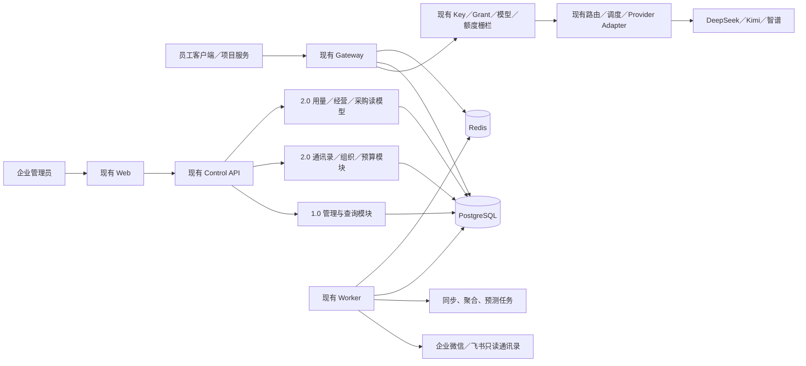

# 仟流智算技术需求文档

| 项目 | 内容 |
| --- | --- |
| 产品版本 | 仟流智算 2.0 标准版 |
| 文档版本 | `v2.0-w20-01-baseline` |
| 更新日期 | 2026-08-12（Asia/Shanghai） |
| 技术 Owner | 佳哥 |
| 当前状态 | `done`：已按确认原型完成技术合同回写；产品实现仍为 `todo` |
| 继承基线 | 当前可用 1.0 `6fc1bec2a211c0d9c399400076cc56720f5c1815`（历史封板参考 `v1.0.0-final`）；数据库迁移 `0045_zhipu_weekday_window_alias` |
| 产品合同 | [《仟流智算产品需求文档 v2.0》](./仟流智算-产品需求文档-v2.0.md) |
| 开发合同 | [《仟流智算开发规划 v2.0》](./仟流智算-开发规划-v2.0.md) |
| 确认原型 | [《仟流智算 2.0 标准版原型》](./原型/仟流智算-2.0-标准版原型.html) |
| 变更依据 | [PC-20260812-03](./Planning-Change-Log.md#pc-20260812-0320-回归客户企业产品10-原位增量升级)、[PC-20260812-04](./Planning-Change-Log.md)、[POOL20-001～024](./仟流智算-2.0-问题蓄水池.md) |
| 文档性质 | 2.0 架构、数据、接口、兼容、迁移、安全、容量与测试合同 |

> **技术总原则**
>
> 仟流智算 2.0 是单个客户企业使用的产品，是 1.0 的原位增量升级。继续使用现有 Web、Control API、Gateway、Worker、PostgreSQL 和 Redis；允许增加表、字段、接口、读模型和页面，不允许为了“做 2.0”删除、替换或静默改写 1.0 已经可用的能力、事实与协议。

## 1. 目标与边界

### 1.1 技术目标

1. 以自动化回归证明 1.0 页面、接口、账本和 Gateway 合同没有被破坏。
2. 在“使用主体”内增加企业微信／飞书通讯录单向同步和 Excel 模板导入；稳定匹配人员，自动建立员工主体并初始化可继续配置的接入配置状态（不后台生成 Key 明文，不伪造额度或授权）。
3. 在现有账本之上提供员工／项目今日、本周、本月聚合，并支持全体与单主体趋势切换。
4. 建立部门、人员、项目的时点归属，形成部门预算、Token、成本和预警，同时保证一条成本事实在部门维度只归属一次。
5. 补强 1.0 月度经营总览、本月采购事实、员工账、项目账和部门账，不重写原始账本。
6. 复用厂商经营快照、额度窗口、供给预测和健康事实，形成逐资源利用率、耗尽和连续无调用事实。
7. 用上述事实形成轻量采购复盘和人工备注，不建设 BI、自动采购或模型决策系统。

### 1.2 本轮不做

- “仟流科技总控台”、Platform API、跨企业目录、企业开通／退租／归档／销毁；
- 支持人员跨控制面访问、平台管理员、企业六态生命周期；
- 共享 SaaS 商业后台、企业订阅和跨客户结算；
- 对账与导出后端；该页签只渲染 `Coming Soon`，不得调用模拟接口；
- 企业坐席／厂商成员账号、厂商实时市场价格、跨厂商效果评价；
- 后台定时执行用户任务、自动采购、自动充值；
- 新 Agent 服务、Agent 写操作或 Agent 参与 Gateway 鉴权、额度、计费、路由和调度。

### 1.3 版本内的企业含义

标准版仍是一套部署服务一个客户企业。现有 `enterprise_id` 继续作为认证上下文和数据归属字段，但 2.0 不提供企业选择器，不允许客户端通过 Header、Query 或 Body 指定企业，也不宣称实现多企业总控或共享 SaaS。

## 2. 目标架构

### 2.1 组件职责

| 组件 | 1.0 责任 | 2.0 增量 |
| --- | --- | --- |
| Web | 全部现有管理页面与下钻 | 确认原型中的新增页签、筛选、趋势和状态；不在浏览器计算金额 |
| Control API | 管理写入、用量和经营查询 | 通讯录配置／导入、组织读模型、周期用量、部门预算／成本、资源利用和采购复盘 API；导入只初始化配置状态，不生成 Key 明文 |
| Gateway | 鉴权、额度、路由、上游调用、Attempt／Usage／Ledger／Settlement | 无新业务决策；只继续产生权威请求事实 |
| Worker | 供给预测、额度窗口、运行保障等任务 | 通讯录同步、导入执行、脏桶聚合和读模型刷新 |
| PostgreSQL | 业务事实与账本权威 | 保存组织时点关系、导入结果、派生聚合、预算和复盘备注 |
| Redis | 可重建缓存、租约、限流 | 同步／聚合任务短租约和读缓存；不得成为组织、预算或成本权威 |

### 2.2 明确删除的旧架构

本技术基线没有 `Platform API`、平台管理员、跨部署企业目录、支持访问会话和企业退租销毁链。V4 早期 ADR／PoC 中仅服务上述旧边界的内容不再构成本版本实现或验收依据；未被本 TRD 明确引用的旧平台条款不得回流到工作包。

## 3. 1.0 不可破坏合同

### 3.1 数据与 Gateway 不变量

- PostgreSQL 是请求、Attempt、Usage、Ledger、Settlement 和经营事实权威；Redis 只保存可重建状态。
- 每个真实消耗 Attempt 独立形成 `usage_event` 和 `ledger_line`；一个下游请求只有一个最终 settlement。
- `ledger_line`、已关闭 `operating_bill_version`、历史规则版本和历史模型 alias 不原地改写。
- Token 额度仍由 `principal_grant + quota_counter` 在 Gateway 原子预占、释放和结算。
- 流式响应提交后不切换或拼接上游；Key、主体、模型、Route、资源或规则失效必须在访问上游前拒绝。
- 价格、倍率、路由、调度和授权使用请求时点快照。
- 默认 `METADATA_ONLY`，不保存请求与响应正文。
- Agent 识别字段只作观测，不参与鉴权、额度、计费、路由或调度。

### 3.2 页面与操作不变量

下列 1.0 能力必须保留真实入口、字段、状态、操作和错误反馈；2.0 只可在原位置叠加能力：

1. 首页当前八项指标／字段及“当前正在使用”提示、条件“需要处理”、资源摘要 14 列、模型原地下钻、本月 Token 总量和员工排行；2.0 六项主概览可以重排，但旧字段必须保留稳定落点，员工日周月属于 FR2-003；
2. 使用主体的新建、编辑、停用／启用、清理预检和完整接入配置；
3. 接入配置中的 Key 生命周期、厂商额度池、逐型号开关、只读授权表和 Agent 使用诊断；
4. 批量模型授权原样保留；
5. 厂商资源登记列表全部字段与操作、额度窗口、供给预测、健康和异常；
6. 统一模型、Model Route、计价规则、调度策略的创建、管理、校验、发布、启停和历史版本；
7. 用量账本全部筛选、分页、URL 可复现状态及 Attempt→Usage→Ledger→Settlement 下钻；
8. 月度经营账单、厂商账单快照导入、员工账／项目账和历史版本；
9. 运行保障五个页签；管理员新增／改名／启停／改密／重置；操作日志和升级日志。

### 3.3 接口兼容

- 现有 Gateway 路径、请求／响应字段、流式事件顺序、错误语义和正文零留存合同保持兼容。
- 现有 Control API 字段不得改变类型、单位、枚举含义或空值语义；新增字段必须可选或有兼容默认值。
- 2.0 新增能力使用新增端点或向后兼容字段；不要求现有客户端提交组织、部门或企业参数。
- OpenAPI／Zod Schema、数据库 `numeric` 和前端类型必须使用同一单位；金额不使用 JavaScript 浮点结算。

## 4. 认证、权限与企业上下文

### 4.1 继续使用现有认证模型

| 调用者 | 凭证 | 允许范围 |
| --- | --- | --- |
| 企业管理员 | 现有 `admin_user + admin_session` | Web 和 Control API 的企业内管理、查询和 2.0 新增操作 |
| 员工／项目主体 | 现有 `principal_key` | Gateway 中已授权模型、额度和并发范围 |
| Worker | 内部服务身份／数据库最小权限 | 领取同步、聚合、预测任务；不暴露公共登录入口 |

2.0 不重建一套角色系统。所有新增管理端点先沿用“当前企业的 ACTIVE 管理员”权限边界；管理员启停、改密、重置密码和 Session 撤销继续使用 1.0 实现。未来出现真实的部门负责人自助管理需求时，再单独增加细粒度 RBAC。

### 4.2 上下文来源

- Control API 的 `enterprise_id` 只来自已认证 `admin_session → admin_user.enterprise_id`。
- Gateway 的 `enterprise_id` 只来自 Key 摘要命中的 Principal。
- Worker Job 在入队时冻结 `enterprise_id`，执行时再次校验对象归属。
- 浏览器、Excel 行、外部通讯录和厂商响应中的企业字段均不可信，不能覆盖认证上下文。
- Repository 的列表、详情、更新和聚合均显式接收 `enterprise_id`；不存在“查全库后在应用内过滤”。

## 5. 数据模型

### 5.1 复用的 1.0 权威对象

| 对象 | 2.0 使用方式 |
| --- | --- |
| `enterprise` | 保留稳定 ID 和名称；增加企业时区、默认货币和乐观锁版本 |
| `admin_user / admin_session` | 继续承担管理员身份和会话，不迁移到平台／Owner 模型 |
| `person / person_external_identity` | 作为员工和外部成员身份；补齐企业归属、飞书和 Excel 员工编号来源 |
| `principal` | 员工／项目使用主体权威；现有 `department_label` 保留为 1.0 兼容投影 |
| `principal_key / principal_grant / principal_access_config_state` | 继续承担 Key、厂商额度池、模型授权和接入配置版本 |
| `ai_request / upstream_attempt / usage_event / ledger_line / ledger_transaction` | Token、费用、路由和结算的唯一基础事实 |
| `operating_bill_period / version / event` | 沿用 DRAFT／CLOSED、重开和不可变版本快照 |
| `provider_resource_operating_snapshot` | 厂商余额、套餐额度、采购成本和经营快照 |
| `provider_quota_window` | Coding Plan 五小时／周窗口事实 |
| `supply_forecast` | 确定性耗尽／恢复事实 |
| `availability_* / alert_event / notification_*` | 继续支撑资源健康、熔断、异常和通知 |

### 5.2 2.0 新增或扩展对象

| 对象 | 关键字段与约束 |
| --- | --- |
| `organization_unit` | `enterprise_id, id, parent_id, name, external_source_id, external_unit_id, status, version`；同一来源外部 ID 唯一 |
| `organization_membership` | `enterprise_id, person_id, organization_unit_id, is_primary, valid_from, valid_until, source, version`；同一人员同一时点至多一个主部门 |
| `directory_source` | `enterprise_id, type(WECOM/FEISHU), config_ciphertext, config_fingerprint, cursor, status, version`；凭证明文不入库、不回显 |
| `directory_import_run` | 来源、`SYNC/EXCEL`、模板／连接器版本、源快照或文件 SHA-256、状态、数量、幂等键、开始／完成时间 |
| `directory_import_item` | Run、外部成员 ID／员工编号、行号、标准化姓名／部门、处理状态、Person／Principal 结果、稳定 reason code |
| `project_department_assignment` | 项目 Principal、部门、`valid_from/valid_until`、来源 `EXPLICIT/OWNER_DEPARTMENT_DEFAULT`、版本 |
| `request_attribution_snapshot` | 请求、源 Principal、员工 Person、项目 Principal、部门、归属来源、请求时点、版本、`supersedes_id`；不可覆盖旧版本 |
| `usage_bucket_aggregate` | 企业、`HOUR/DAY`、时区桶、源 Principal、项目、资源、统一模型、请求／Token／扣减／费用、事实水位和生成时间 |
| `department_budget` | 企业、部门、月份、币种、金额、警戒线、版本；`(enterprise_id, department_id, month)` 唯一 |
| `resource_purchase_record` | 资源、`API_RECHARGE/PACKAGE_PURCHASE`、金额、币种、购买时间、服务起止、来源、凭证引用和创建人；append-only |
| `procurement_review_note` | 企业、月份、人工备注、版本、更新人和时间；每月一个当前版本，修改留操作日志 |

`provider_resource` 增加可选 `monthly_budget_amount/monthly_budget_currency`，只用于 API 利用率分母，不改变“资源登记与列表”的 1.0 表头和数值。未配置分母时利用率必须返回 `null/NOT_CONFIGURED`，不能显示 0%。

### 5.3 外键与历史保护

- 新表直接携带非空 `enterprise_id`，企业内关系使用同企业复合约束或在同一事务内做归属校验。
- `person` 回填企业归属时，只能由已绑定 Principal 或部署内唯一企业清单证明；一个 Person 映射到多个企业时迁移阻断，不按姓名猜测。
- 组织调整只结束旧 Membership、创建新 Membership；项目部门变更同理。
- 请求归属修正创建新的 `request_attribution_snapshot` 并引用上一版本；旧版本和已关闭账单快照不更新。
- `principal.department_label` 是兼容投影：当前主部门变更时在同一事务更新，供 1.0 页面继续读取；成本计算不以可变文本标签作为历史权威。

## 6. 通讯录同步与 Excel 导入

### 6.1 数据源和方向

- 支持企业微信、飞书接口单向读取，以及仟流规定的 `.xlsx` 模板上传。
- 数据源首次配置和更新都在“使用主体 → 组织通讯录”内完成，不增加一级设置页。
- 系统不向企业微信、飞书或 Excel 回写人员、部门、职位、Key、Grant、用量或停用状态。
- 通讯录页不提供手工新增、调岗、停职等 HR 操作；这些变化在源系统维护后由下一次同步带入。
- 外部成员消失或标记离职时，只记录 `SOURCE_INACTIVE/PENDING_REVIEW`，不得自动停用、删除主体或撤销 Key。管理员仍使用 1.0“使用主体”的停用／清理操作。

### 6.2 匹配和自动配置

匹配顺序固定为：

1. 同一个 `directory_source + external_member_id` 的既有 `person_external_identity`；
2. Excel 中显式填写且校验通过的 `existing_principal_id`；
3. 同企业唯一、已登记的员工编号；
4. 无稳定匹配时，新建 Person 和员工 Principal。

禁止仅按姓名、邮箱前缀、部门名称或模糊相似度合并。稳定 ID 指向不同人员、一个员工编号命中多个对象、显式 Principal 不属于当前企业或不是员工类型时，该 Item 进入 `CONFLICT`，不静默覆盖，其他无冲突 Item 可继续完成。

新员工 Item 在一个数据库事务中完成：

1. 创建／绑定 Person 和外部身份；
2. 创建 `principal(type=EMPLOYEE)`；
3. 创建当前组织 Membership，并同步兼容 `department_label`；
4. 创建 `principal_access_config_state`；
5. 计算当前已发布的批量模型授权规则并生成可配置结果；没有已发布规则时保持空授权；
6. 将 Key 状态置为“待首次领取”，不得在后台生成或保存可回读的 Key 明文。

已匹配主体只更新来源身份和有效期关系，不重置 Key、不覆盖手工额度、不删除 Grant。

### 6.3 异步、幂等和失败处理

- 接口同步：Control API 创建 `directory_import_run=QUEUED`，Worker 拉取源快照并处理。
- Excel：Control API 限制文件大小和行数，校验模板版本、工作表、列、公式和类型，保存标准化 staging 行后返回 `202`；Worker 不保留原文件正文。
- Run 状态为 `QUEUED → RUNNING → SUCCEEDED/PARTIAL/FAILED`；Item 状态为 `MATCHED/CREATED/UPDATED/CONFLICT/SKIPPED/FAILED`。
- 同一来源快照版本，或同一 Excel `file_sha256 + template_version`，使用同一幂等键重试时返回原 Run；不得重复创建 Person、Principal、Membership 或接入配置。
- 单个 Item 的人员、主体、组织和配置写入必须原子；允许跨 Item 部分成功，并返回逐行 reason code。
- Worker 崩溃后从未完成 Item 恢复；租约到期可重领，所有写入仍受唯一约束和幂等键保护。
- 首发限制：Excel ≤5 MiB、≤1,000 行；通讯录单次有效成员 ≤1,000。超过限制稳定拒绝，不在请求进程中无限解析。

### 6.4 Excel 安全

- 只接受 `.xlsx`，拒绝宏、外链、公式、隐藏执行内容、未知模板版本和压缩炸弹。
- 姓名、员工编号、部门路径和显式 Principal ID 均有长度和字符限制；单元格值按文本处理，不执行公式。
- 日志只记录 Run ID、行号、计数和 reason code，不记录通讯录 Token、Secret 或整行个人信息。

## 7. 员工／项目周期用量

### 7.1 时间边界

企业时区来自 `enterprise.timezone`，默认 `Asia/Shanghai`：

- 今日：本地时间 `[00:00, 次日 00:00)`，趋势按小时；
- 本周：周一 `[00:00` 到下周一 `00:00)`，趋势固定周一至周日；
- 本月：自然月 `[月初 00:00, 下月月初 00:00)`，趋势按日；
- 前端只提交 `period + anchor + subject_type + subject_id?`，实际起止时刻由服务端计算并回传。

### 7.2 统计口径

- “真实 Token”固定为 `input_tokens + output_tokens`；缓存和推理 Token 单独展示，不重复加入总 Token。
- 请求数按 `ai_request_id` 去重；费用来自已结算 `ledger_line.api_cost`；套餐扣减来自 `deducted_quota`。
- 员工视图按员工 Principal；项目视图同时包括项目 Principal 直接请求和显式归入该项目的员工请求。
- “全部员工／全部项目”返回整体指标、趋势和排名；指定主体后，指标和趋势只统计该主体。
- 主体选择器使用服务端搜索／分页或等价的可检索 Combobox；不得把全部人员一次性硬编码进静态 `<select>`。
- 选择排名姓名与选择下拉框必须进入同一查询状态。
- 用量概览与 1.0“请求明细”共用同一账本事实；概览不能成为第二套账本。

### 7.3 聚合实现

`usage_bucket_aggregate` 是可重建读模型，不是结算事实：

- Worker 每 5 分钟重算脏小时桶；每天补算最近 7 天，Settlement 或归属变化会显式标记对应桶为 dirty。
- Upsert 使用完整桶重算结果，不用“上次结果 + 增量”，避免任务重放重复累计。
- 唯一键包含企业、桶粒度、桶起点、源 Principal、项目、资源和统一模型；nullable 维度使用稳定哨兵或 `NULLS NOT DISTINCT` 约束。
- 每行保存来源 `ledger_line` 水位、最大事实时间和 `generated_at`。超过 10 分钟未刷新时响应返回 `stale=true`，页面显示数据时间，不伪装实时。
- 月度关账、成本守恒和请求下钻始终读取基础账本或冻结账单，不依赖可重建聚合表。

## 8. 部门归属、成本与预算

### 8.1 请求的部门唯一归属

对每个请求按请求发生时点生成归属快照：

1. 项目 Principal 直接请求：归入该项目时点有效的项目部门；
2. 员工请求已显式归入项目：员工账仍可查看该请求，项目账也可查看；部门账只归入项目时点部门一次；
3. 员工请求未归项目：归入员工在请求时点的主部门，记为“员工直接成本”；
4. 缺少有效人员、项目或部门关系：归入“待归属”，不得按当前负责人、相同名称或最新部门猜测。

项目未显式指定部门时，可以在建立关系时把负责人当时的主部门保存为 `OWNER_DEPARTMENT_DEFAULT`；负责人后续调岗不改写该历史 Assignment。管理员通过现有主体编辑或项目归集入口修正时，必须按请求时点重新解析并追加 Attribution 版本。

### 8.2 成本守恒

- API 成本逐行取 `ledger_line.api_cost`。
- 套餐成本继续使用 1.0 月账算法：同资源当月套餐费用按已知 `deducted_quota` 比例分配；分母为 0、扣减未知或快照缺失时进入“未分摊”，不做静默 fallback。
- 金额使用 PostgreSQL `numeric(24,8)` 和 Decimal；尾差按稳定对象 ID 的最大余数法处理。
- 员工账、项目账、部门账是同一事实的不同视图，不能把员工账合计与项目账合计相加作为企业成本。
- 部门维度必须满足：`全部已归属部门成本 + 待归属成本 = 企业当月总成本`。
- 每个部门展示员工直接成本、项目成本、合计成本、实际 Token、API 费用、套餐分摊和归属状态。

### 8.3 部门预算

- 部门预算按企业、部门、自然月和币种保存，使用乐观锁版本更新。
- `预算使用率 = 部门归集成本 ÷ 月度预算`；实际 Token 只作为用量事实，不作为金额比例分母。
- 预算为空或 0 时状态为 `NOT_SET`；低于警戒线为 `NORMAL`；达到警戒线为 `WARNING`；达到或超过 100% 为 `OVER_BUDGET`。
- 预算只在 Web、通知和经营读模型中预警，不进入 Gateway，不阻断请求，不新增跨部门 Token 硬额度。
- 预算变更不改写历史账本；已关闭月份默认只读，若业务允许修正必须先按 1.0 流程重开账单。

## 9. 月度经营账单

### 9.1 沿用的账期模型

- `operating_bill_period.status` 继续只有 `DRAFT/CLOSED`；“检查失败”是检查结果，不新增账期状态。
- 重开将当前账期返回 `DRAFT`，旧 `operating_bill_version` 继续保留；再次关闭生成新版本。
- 草稿读取当前账本和经营快照；关闭版本保存不可变 Snapshot 和下钻所需事实。
- Close 与在途 Settlement 继续使用 1.0 的月份写栅栏和锁序，不因部门归集增加反向锁。

### 9.2 月度总览口径

| 指标 | 口径 |
| --- | --- |
| 本月真实 Token | 当月已结算 `input + output` |
| API 实际费用 | 当月 `ledger_line.api_cost` 合计 |
| 套餐支出／成本 | 当月有效 Coding Plan 采购成本，未分摊仍计入企业总额 |
| 本月总支出／总投入 | `API 实际费用 + 套餐支出` |
| API 预付余额 | 月末最新有效经营快照余额；资产余额，不计入本月支出 |
| 活跃使用主体 | 当月有已结算请求的员工和项目主体数 |
| 活跃人数（首页） | 只统计当月有已结算请求的员工人数，不包含项目 |
| 厂商接入账号（首页） | 已登记 Provider Resource 账号数，不按模型重复计数 |
| 本月采购／充值现金支出 | `resource_purchase_record` 当月现金流；可能与本月成本不同 |

“厂商成本构成”和“本月买了什么”都必须明确标记成本口径与现金口径，不能互相替代。

### 9.3 员工、项目和部门账

- 继续复用既有 `/operating-bills/:month/employees`、项目账和模型／请求下钻。
- 员工账保留厂商下拉、员工搜索、分页和筛选后服务端合计。
- 项目账展示负责人和时点归属部门；不得用当前负责人部门回算已关闭月份。
- 部门账使用 §8 唯一归属算法，并单列待归属。
- 当某一维度存在未知 Token、未知费用或未分摊成本时，响应字段返回 `null + reason_code`，不能把未知当 0。

### 9.4 检查与 1.0 快照导入

- 新增只读“检查账单”动作，返回未知计量、缺经营快照、待归属、分摊不完整和守恒差异；检查本身不改变 `DRAFT`。
- 1.0 已有厂商账单快照 CSV 导入继续保留，来源仍为 `BILL_RECONCILIATION`，只允许草稿月份使用。
- “对账与导出”页签与厂商账单快照导入不是同一功能：前者本轮无后端，后者是必须回归的 1.0 能力。

## 10. 资源利用、耗尽、闲置事实与采购复盘

### 10.1 资源利用读模型

逐个 `provider_resource` 返回：

- API：本月真实 Token、实际费用、余额、24h 消耗速度；配置月度预算时返回 `实际费用 ÷ 月度预算`，未配置时利用率为 `NOT_CONFIGURED`；
- Coding Plan：分别返回厂商五小时窗口和周窗口的已用、剩余、比例、重置时间与同步状态，禁止合成一个来历不明的百分比；
- 耗尽：复用 `supply_forecast` 的预计耗尽、下一恢复、覆盖时长、可信度和不可计算原因；
- 闲置事实：最近已结算请求时间、连续无调用天数和数据水位。本版没有冻结统一闲置阈值，因此自动状态固定为 `UNASSESSED`，不得仅因 Token 少就判定闲置；
- 健康：继续由 1.0 资源健康／异常模块提供，不在利用读模型中复制一套状态机。

最新额度窗口或经营快照过期、预测超过 15 分钟、余额未知或没有可用速度时，页面必须显示 `STALE/NOT_CALCULABLE` 和原因，不输出伪精确日期。

### 10.2 采购复盘

采购复盘只组合已有事实：

- 本月采购现金金额；
- API 实际费用；
- 各资源真实 Token、适用利用率、耗尽和连续无调用事实；
- 轻量建议标签及其确定性依据；
- “采购复盘备注（人工填写）”。

建议标签不创建采购单、不修改资源、不发布额度或调度策略。页面不得出现没有动作含义的“人工判断”状态；人工意见只保存在备注中。备注最长 4,000 字，使用乐观锁和操作日志。

### 10.3 Agent 边界

继续保留 1.0 的 `principal_agent_expectation`、`/principals/:id/agent-usage` 和真实请求中的 Agent 观测展示。2.0 不增加 Agent 服务、Agent 权限字典或 Agent 任务执行；观测字段不得进入资源利用率、归属、预算、计费和路由决定。

## 11. API 合同

### 11.1 保持不变的主要 1.0 API

以下只是关键清单，不改变现有 OpenAPI／Zod 细节：

- `/auth/*`、`/admins/*`；
- `/principals`、`/principals/:id`、清理预检、启停、Key、Grant 和 `/principals/:id/access-configuration`；
- `/employee-model-rules/*`；
- `/providers`、`/provider-resources*`、`/unified-models*`、`/model-routes*`；
- `/billing-rules*`、`/dispatch-policies*`；
- `/dashboard`、`/usage`、请求下钻和 Agent 诊断；
- `/operating-bills*`、员工账／项目账／模型请求下钻和厂商快照导入；
- `/runtime-assurance/*`、`/availability-*`、`/alerts`、`/notification-*`；
- `/operation-logs`、`/deployment-logs*`。

### 11.2 2.0 新增／扩展 API

| 方法与路径 | 作用 | 关键合同 |
| --- | --- | --- |
| `GET/PATCH /enterprise-settings` | 企业名称、时区、默认货币 | `expected_version`；时区变化不改写已关闭月份 |
| `GET /organization-units` | 当前组织树 | 只返回当前企业，支持状态筛选 |
| `GET /directory-members` | 通讯录成员与主体／配置状态 | 分页、部门、处理状态和搜索 |
| `GET/PUT /directory-sources/:type` | 企业微信／飞书连接配置 | `type=WECOM/FEISHU`；Secret 只写不回显，返回指纹 |
| `POST /directory-sync-runs` | 发起接口同步 | `source_id + idempotency_key`；返回 `202 + run_id` |
| `GET /directory-import-runs/:id` | Run 进度与汇总 | 状态、计数、错误分类、数据时间 |
| `GET /directory-import-runs/:id/items` | 逐项结果 | 分页；冲突不泄露无权对象 |
| `GET /directory-excel-template` | 下载固定版本 Excel 模板 | 返回版本和 SHA-256 |
| `POST /directory-excel-imports` | 上传 Excel | multipart；模板／大小／行数限制；返回 `202` |
| `GET /usage/overview` | 日／周／月用量 | `subject_type, subject_id?, period, anchor`；返回范围、趋势、排名、水位和 stale |
| `GET/PUT /department-budgets/:departmentId/:month` | 读取／保存部门预算 | 金额字符串、警戒线、`expected_version` |
| `GET /operating-bills/:month/departments` | 部门成本与 Token | 员工直接、项目、待归属和守恒摘要 |
| `POST /operating-bills/:month/check` | 只读账单检查 | 不改变账期状态；返回结构化 gap |
| `GET/POST /provider-resources/:id/purchases` | 读取／登记本次充值或套餐采购 | append-only；金额字符串；写操作幂等 |
| `GET /provider-resources/utilization` | 逐资源利用／耗尽／闲置事实 | `month`；返回原始口径、数据时间和不可计算原因 |
| `GET /procurement-reviews/:month` | 采购复盘读模型 | 事实、利用率、标签、依据和备注版本 |
| `PUT /procurement-reviews/:month/note` | 保存人工备注 | `expected_version + idempotency_key` |

现有 `/dashboard` 和 `/operating-bills/:month` 只增加确认原型所需的向后兼容字段；`monthlyRechargeAmount`、`monthlyDispatchSaving`、`earliestExhaustion`、`resourceBreakdown[].status` 等旧字段继续返回。

### 11.3 明确不存在的 API

本版本不注册 `/platform/*`、`/enterprises` 目录、`/support-access*`、企业生命周期、`/exports*`、对账执行或 Agent 执行端点。“对账与导出”页签不得以假数据或未注册 API 模拟成功。

### 11.4 通用写入合同

- 服务端 Schema 校验、当前企业对象归属校验和稳定错误码；
- 幂等写入使用 `Idempotency-Key` 或正文 `idempotency_key`，同键异参返回冲突；
- 可编辑对象使用单调 `version/expected_version`，旧版本返回 `409`；
- 写入、失败和批处理摘要进入 `operation_log`；
- 响应不返回 Provider Secret、通讯录 Secret、Key 明文历史、Cookie、正文或内部加密材料；
- 列表和聚合均分页／限范围，空结果返回空数组和零／null 合计，不返回演示数据。

## 12. Worker、Redis 与一致性

### 12.1 任务类型

新增任务仅包括：

- `DIRECTORY_SYNC`：拉取一个配置源；
- `DIRECTORY_IMPORT_APPLY`：处理一个同步或 Excel Run；
- `USAGE_BUCKET_REBUILD`：重算指定时间桶；
- `ATTRIBUTION_BACKFILL`：为迁移历史或明确修正后的请求补归属。

资源额度窗口、供给预测和运行保障 Worker 继续使用 1.0 任务，不另建重复调度器。

### 12.2 一致性

- Job 至少保存 `enterprise_id, job_type, aggregate_id, idempotency_key, attempt, lease_until`。
- Redis 租约只用于避免并行重复劳动；唯一约束、事务和幂等表才是重复写入的最终防线。
- 外部通讯录请求和数据库写入不能处在一个长事务中：先拉取并标准化，再逐 Item 短事务落库。
- 聚合任务不跨 HTTP 调用持有数据库事务。
- Redis 不可用时不影响 Gateway 既有 fail-closed 边界；同步／聚合任务延后并标记 stale，不能改用内存当权威。

## 13. 迁移、兼容与回滚

### 13.1 迁移原则

- W20-01 已核验当前仓库迁移头为 `0045_zhipu_weekday_window_alias`，下一可用编号为 `0046`；后续仍须在领取迁移编号前复核真实迁移头。
- 只做加性表／列／索引和可验证的约束扩展；不删除 1.0 列，不改写已关闭账单和历史账本。
- 大表索引使用可控锁时方案；上线前在生产数据副本记录执行时间、锁等待和磁盘增长。
- 每个迁移提供 `up/down`，但 down 的可用条件由 §13.3 约束。

### 13.2 建议迁移批次

1. `MIG-A`：企业设置、Person 企业归属、组织、Membership、通讯录来源／Run／Item；
2. `MIG-B`：项目部门 Assignment、请求 Attribution Snapshot 与兼容回填；
3. `MIG-C`：用量聚合表、脏桶索引和 Worker 幂等基础；
4. `MIG-D`：部门预算、资源月预算字段、采购记录和采购复盘备注。

最终文件名可以在开发工作包内细分，但依赖顺序不得反转。

### 13.3 升级与回滚路径

| 阶段 | 回滚方式 |
| --- | --- |
| 迁移前 | 恢复升级前备份；1.0 继续运行 |
| Schema 已升级、2.0 新写入前 | 可执行 down，并校验 1.0 表 Hash、账本数量与金额／Token 守恒 |
| 已有通讯录／预算／归属新写入 | 不执行破坏性 down；关闭 2.0 Feature Flag，保留新增表，回退到兼容这些附加表的 1.0 应用候选 |
| 2.0 读模型异常 | 关闭对应页面／Worker，清空并重建派生聚合；不得回滚或改写 Ledger |
| 归属／成本异常 | 停止部门账和预算展示，保留员工／项目 1.0 账；修正后重建 Attribution 与读模型 |

通讯录新建的 Principal 是 1.0 兼容对象，因此应用回退后仍可在“使用主体”中看到和管理；组织历史、预算和复盘备注留在附加表中等待前向修复。

### 13.4 Feature Flag

- `FEATURE_DIRECTORY_IMPORT`；
- `FEATURE_USAGE_OVERVIEW_V2`；
- `FEATURE_DEPARTMENT_COST`；
- `FEATURE_RESOURCE_UTILIZATION_V2`；
- `FEATURE_PROCUREMENT_REVIEW`。

Flag 只控制新增页面、API 和 Worker，不得改变 Gateway 或隐藏 1.0 页面。默认在测试环境逐项开启，同一发布候选通过回归后再在标准部署开启。

## 14. 安全与审计

### 14.1 Secret 和个人信息

- 通讯录 Secret 复用现有 KEK 体系，以 AES-256-GCM、随机 nonce、认证标签和 `key_version` 保存；API 只返回指纹和连接状态。
- Provider Secret、Principal Key、Session 和通讯录 Secret 不写日志、Trace、错误详情、Run Item 或 Excel 结果。
- Excel 原文件在结构化 staging 完成后不保留；若实现需要短时临时文件，必须使用进程私有目录、随机名、0600 权限并在成功／失败路径删除。
- 日志中的人员信息只保留内部 ID 和受控显示名；Metrics 不使用人员、部门、项目或外部成员 ID 作为 label。
- 请求／响应正文零留存合同不因通讯录或经营分析改变。

### 14.2 必须审计的动作

- 通讯录来源创建／更新／禁用和连接检测；
- 同步／Excel Run 的发起、完成、失败和逐项冲突摘要；
- 自动创建／匹配 Principal、兼容 `department_label` 更新和归属修正；
- 部门预算新增／修改；
- 采购／充值记录新增；
- 采购复盘备注修改；
- 1.0 原有 Key、Grant、资源、规则、关账、重开、管理员和日志动作继续审计。

审计只保存变更摘要、对象 ID、版本、结果、reason code、操作者和时间，不复制 Secret 或完整导入行。

### 14.3 负向测试重点

- 伪造企业 ID、跨企业对象 ID、Run ID、部门 ID、Principal ID；
- 用同键异参重放同步、Excel、预算和备注写入；
- 外部成员 ID／员工编号冲突、同名误合并和 Excel 显式 Principal 越界；
- Secret 回显、日志泄漏、公式／宏／外链和压缩炸弹；
- 停用 Principal 仍能调用、导入自动恢复旧 Key／Grant；
- 项目与员工请求在部门账重复计费；
- 未配置利用率分母却显示 0%，过期预测仍显示耗尽日期。

## 15. 性能、容量与恢复

### 15.1 标准容量包络

- 100 名员工；
- 100 个项目、200 个 Principal（员工、项目和自动化工作负载合计）；
- 50 个并发 Gateway 请求，其中最多 20 个流式连接；
- 每月 100 万条已结算 `ledger_line`；
- Excel／单次通讯录有效成员最多 1,000；
- 常用管理查询 P95 ≤500ms；单主体日／周／月查询 P95 ≤800ms；
- 资源利用和部门月账 P95 ≤1s；
- 通讯录 1,000 人导入在 10 分钟内完成，逐项结果可查询；
- 聚合正常新鲜度 ≤10 分钟。

Gateway TTFT、失败率和上游耗时继续使用 1.0 性能基线；2.0 管理读模型不得向 Gateway 热路径增加同步查询或锁。

### 15.2 索引和查询

- 复用 `ledger_line(enterprise_id, created_at, ai_request_id)` 与请求／Principal／模型索引；
- 新增 Membership 有效期、Attribution 当前版本、Usage Bucket、部门预算月份、采购月份和 Run 状态索引；
- 月账和部门账禁止把 100 万行拉到 Node 聚合，使用 PostgreSQL 分组／读模型；
- 列表默认 25，最大 100；导入 Item 和通讯录成员必须分页。

### 15.3 恢复

- 继续执行现有每日加密备份、隔离恢复和发布前备份；目标 RPO≤24h、RTO≤4h。
- 恢复后先校验迁移版本、企业 ID、Ledger／Settlement 守恒，再重建 Usage Aggregate 和资源利用缓存。
- 派生聚合、同步租约和 Redis 缓存不进入业务事实恢复判定；丢失后可重建。

## 16. 测试与验收

### 16.1 1.0 回归基线（FR2-001）

同一候选必须自动回归：

1. 首页当前八项指标／字段、条件“需要处理”、资源摘要 14 列、模型原地下钻、本月 Token 总量和员工排行；四项旧字段迁位后仍有直接字段 oracle；
2. 使用主体新建／编辑／启停／清理、Key、Grant 和完整接入配置；
3. 批量模型授权；
4. 厂商资源登记列表字段、三类资源数据、行内操作、五小时／周窗口、预测和健康；
5. 统一模型、Model Route、计价规则和调度策略全部生命周期；
6. 用量账本筛选、URL 恢复、分页和请求证据链；
7. 月度总览、员工账厂商筛选／员工搜索、项目账、快照导入、关账／重开／版本；
8. 运行保障五页签；
9. 管理员启停／改密／重置、操作日志和升级日志；
10. Gateway 协议、流式、路由、额度、计价、Attempt／Usage／Ledger／Settlement 和正文 canary。

任一既有功能缺失、字段口径变化、原入口失效或账本不守恒，均按 P0/P1 阻断 2.0 候选。

### 16.2 2.0 功能测试

| FR | 必测内容 |
| --- | --- |
| FR2-002 | 企业微信／飞书、Excel、同文件重放、部分失败、稳定匹配、新主体原子创建、无默认规则、源停用不自动停主体 |
| FR2-003 | 今日／周一至周日／自然月、全体与单主体、员工／项目、排名跳转、时区、stale 和零数据 |
| FR2-004 | Membership／项目变更时点、员工归项目、项目直发、待归属、Token／金额守恒、预算三状态和不阻断 Gateway |
| FR2-005 | 现金采购与成本区分、月度指标、员工筛选搜索、项目部门、部门账、检查、关闭／重开版本稳定 |
| FR2-006 | API 无分母、Coding Plan 双窗口、预测过期／不可计算、最近使用／无调用天数、原页下钻 |
| FR2-007 | 逐资源利用率、确定性标签依据、备注并发／幂等、无自动采购副作用 |

### 16.3 数据、属性与并发测试

- 任意账本样本均满足部门唯一归属和成本守恒；未知输入保持未知，不转 0。
- 导入 Run、Item、Membership、Attribution、Budget 和 Note 的幂等与乐观锁。
- Settlement、项目归集修正、聚合重建和账单 Close 并发下不丢行、不重复累计。
- 从 W20-01 核验的真实迁移头升级到全部 2.0 迁移、Feature Flag 回退、读模型重建、允许条件下 down 和再次升级。
- 100 万 ledger、100 员工、100 项目、200 Principal、1,000 行导入的标准容量测试。

### 16.4 AI Eval

`AI Eval = N/A`。本版本没有生成式 Agent 决策；授权、计量、归属、预算、利用率、标签和成本均为确定性规则，应使用单元、属性、集成、E2E、安全、性能和恢复测试，不能用模型评分替代。

## 17. 可观测性与 Evidence

### 17.1 指标与日志

- Directory：Run 时长、Item 总数、成功／冲突／失败数、连接器错误分类和最后成功时间；
- Usage Aggregate：dirty 数、重建时长、延迟、水位和 stale 数；
- Attribution：待归属请求／Token／金额、重算次数和守恒差异；
- Budget：预警部门数，不把部门名作为 Metrics label；
- Resource：窗口新鲜度、预测新鲜度、不可计算原因和连续无调用天数；
- API：request ID、模块、状态、reason code、耗时，不记录 Secret 和正文。

### 17.2 最小 Evidence

每个工作包只需形成：候选 Commit／Tree Hash、对应 FR／TRD 条款、迁移清单、实际测试命令与原始结果、兼容／回滚结论和未解决风险。命中 Secret、账本、迁移或成本守恒的工作包必须包含相应负向测试；不要求为同一对象重复制造多轮报告或默认“双 AI 审核”。

## 18. FR—技术追溯

| FR | 技术章节 | 关键实体 | 关键 API |
| --- | --- | --- | --- |
| `FR2-001` 1.0 兼容 | §3、§13、§16.1 | 全部 1.0 表；Feature Flag | §11.1 全部既有 API |
| `FR2-002` 通讯录 | §5.2、§6、§12、§14 | `organization_unit`、`organization_membership`、`directory_source/import_run/import_item`、`person_external_identity`、`principal_access_config_state` | `/directory-*`、`/organization-units`、既有 `/principals/:id/access-configuration` |
| `FR2-003` 周期／单主体用量 | §7、§12、§15 | `usage_bucket_aggregate`、现有请求／账本 | `GET /usage/overview`、既有 `GET /usage` |
| `FR2-004` 部门预算与唯一归集 | §5.2、§8 | `organization_membership`、`project_department_assignment`、`request_attribution_snapshot`、`department_budget` | `/department-budgets/*`、`GET /operating-bills/:month/departments` |
| `FR2-005` 月度经营账单 | §8.2、§9 | 现有 `operating_bill_*`、`resource_purchase_record`、Attribution | `/operating-bills/*`、`/provider-resources/:id/purchases` |
| `FR2-006` 资源利用事实 | §10.1、§15 | `provider_resource_operating_snapshot`、`provider_quota_window`、`supply_forecast`、`ledger_line` | `GET /provider-resources/utilization`、既有资源窗口／预测／健康 API |
| `FR2-007` 采购复盘 | §10.2 | `resource_purchase_record`、`procurement_review_note`、资源利用读模型 | `GET /procurement-reviews/:month`、`PUT /procurement-reviews/:month/note` |

## 19. 技术完成条件

TRD 对应的产品候选只有同时满足以下条件才可标记 `done`：

1. §16.1 的 1.0 回归全部通过，确认原型中的 1.0 入口和字段未减少；
2. FR2-002～007 的正常、空、错误、权限、幂等和并发路径通过；
3. `0044→2.0` 迁移、Feature Flag 回退和读模型重建在同一候选验证；
4. 部门成本守恒、月账守恒、重复结算为 0，未知值没有被伪造为 0；
5. Secret／正文 canary 命中为 0，Excel 和外部通讯录负向测试通过；
6. 容量包络内的管理查询、聚合新鲜度和导入时限达标；
7. “对账与导出”没有后端调用，Agent 没有进入热路径，旧平台控制面没有被实现；
8. Evidence 绑定实际候选，遗留 P0/P1 为 0。
