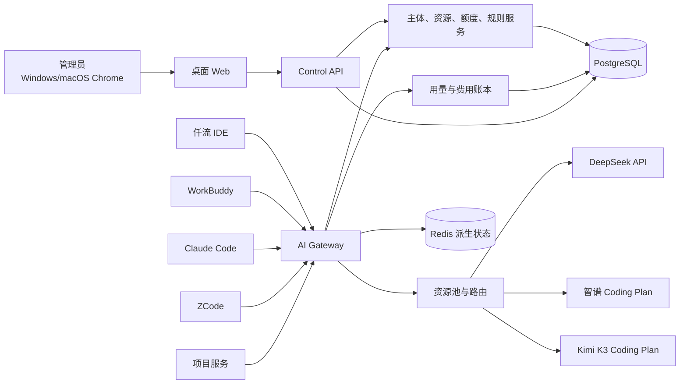

# 仟流智算技术需求文档

| 项目 | 内容 |
| --- | --- |
| 产品名称 | 仟流智算 |
| 文档版本 | v0.2 |
| 更新时间 | 2026-07-26 |
| 技术负责人 | 佳哥 |
| 适用阶段 | Stage 01 方案准备 |
| 当前状态 | 技术方案候选；等待兼容性 PoC 和原型走查 |
| 产品需求基线 | [《仟流智算产品需求文档 v0.2》](./仟流智算-产品需求文档-v0.2.md) |
| 唯一技术权威 | 本文 |

## 1. 技术目标

在不采集员工电脑内容、不把上游真实凭证交给员工的前提下，建立一个对 OpenAI 和 Anthropic 协议兼容的企业 Gateway：

1. 识别员工或项目；
2. 校验其模型权限和额度；
3. 从企业资源池选择可用上游；
4. 转发并流式返回结果；
5. 记录原始用量、额度扣减和实际费用；
6. 为桌面 Web 提供可查询、可解释的资源和账本数据。

## 2. 技术边界

### 2.1 仟流智算负责

- 单企业管理员和员工登录；
- 员工／项目统一使用主体；
- 下游虚拟 Key；
- 上游资源账号和凭证；
- OpenAI／Anthropic 兼容 Gateway；
- DeepSeek、智谱、Kimi 上游适配；
- 资源池和路由；
- 额度、分时价格和扣减规则；
- 用量账本、费用和异常；
- 桌面 Web。

### 2.2 仟流 Platform 和仟流 IDE

- 仟流 IDE 是一期员工客户端之一。
- 仟流 IDE 通过现有 Model Gateway 接入仟流智算，不复制智算领域逻辑。
- 仟流 Platform 的通用 Agent、任务、Skill、权限和知识能力不属于一期智算服务器热路径。
- 二期仟流智算 Agent 通过智算公开管理 API 工作；一期只预留入口和接口边界。

### 2.3 一期不建设

- 终端采集程序；
- 网络透明代理；
- 移动端；
- 外部通知适配器；
- 多企业管理界面；
- 员工任务到项目的动态费用归属；
- 自动解析厂商网页并更新价格；
- 保存模型调用正文。

## 3. 总体架构



### 3.1 部署形态

一期采用模块化单体加独立 Gateway 进程：

- `web`：React 桌面 Web；
- `control-api`：登录、资源、主体、额度、查询和操作日志；
- `gateway`：北向协议、鉴权、路由、流式转发和计量；
- `worker`：聚合、异常检测、规则生效、周期重置和对账任务；
- PostgreSQL：唯一业务事实源；
- Redis：并发、短期状态、速率和缓存，不作为最终账本。

内部试用可以部署在一台 Linux 服务器的多个容器中。Web 和 Gateway 通过公网 HTTPS 提供服务，数据库、Redis 和上游凭证服务仅在内网访问。

## 4. 推荐技术栈

| 层 | 技术 |
| --- | --- |
| Web | React + TypeScript + Vite |
| 服务端 | TypeScript + Node.js LTS |
| HTTP | Fastify + undici/Web Streams |
| 数据库 | PostgreSQL 15+ |
| 缓存 | Redis 7+ |
| 数据访问 | 轻量 SQL/Query Builder，迁移文件管理 Schema |
| 测试 | Vitest + Testcontainers + Playwright |
| 金额和倍数 | PostgreSQL `numeric` + 十进制计算库 |
| 部署 | Docker Compose 起步，Nginx/Caddy 终止 TLS |

具体依赖版本在 Stage 02 锁定。若压测证明 Node Gateway 无法满足流式并发，再通过技术决策记录评估拆分，不能预先增加第二套语言栈。

## 5. 核心领域模型

### 5.1 企业和账号

| 对象 | 关键字段 |
| --- | --- |
| `enterprise` | `id`、`name`、`status` |
| `admin_user` | `id`、`enterprise_id`、`username`、`password_hash`、`status` |
| `employee_login` | `principal_id`、`username`、`password_hash`、`must_change_password` |
| `admin_session` | `id`、`admin_user_id`、`expires_at` |

一期只有一个企业。所有管理员权限相同，不建立角色层级。

### 5.2 使用主体

统一表 `principal`：

| 字段 | 说明 |
| --- | --- |
| `id` | 稳定主体 ID |
| `enterprise_id` | 企业 |
| `type` | `EMPLOYEE` 或 `PROJECT` |
| `name` | 员工名或项目名 |
| `department_label` | 员工可选信息 |
| `status` | `ACTIVE`、`DISABLED` |
| `created_at`、`updated_at` | 时间 |

所有凭证、分配、额度、请求、账本和异常只引用 `principal_id`，不为项目复制第二套表。

### 5.3 下游 Key

`principal_key`：

- `id`；
- `principal_id`；
- `key_prefix`；
- `key_digest`；
- `status`；
- `created_at`；
- `last_used_at`；
- `revoked_at`。

规则：

- 每个主体默认只有一把有效主 Key。
- 数据库只保存带服务器 Pepper 的不可逆摘要。
- 创建或重置时只返回一次明文。
- 重置使用单事务撤销旧 Key、创建新 Key。
- 停用主体时撤销全部有效 Key。

### 5.4 厂商资源

`provider_resource`：

- 厂商：`DEEPSEEK`、`ZHIPU`、`KIMI`；
- 模式：`API`、`CODING_PLAN`；
- 资源名称和上游账号；
- 支持模型；
- 充值金额、余额或套餐费用；
- 总额度、剩余额度和原生单位；
- 生效、失效、重置时间；
- 状态：`ACTIVE`、`DEGRADED`、`EXHAUSTED`、`EXPIRED`、`CREDENTIAL_INVALID`、`UNAVAILABLE`；
- 上游凭证版本；
- 资源池和优先级；
- API 兜底开关。

上游 Secret 使用信封加密或 KMS/Vault 保存。列表和日志只显示指纹。

### 5.5 模型授权和额度

`principal_grant`：

- `principal_id`；
- `provider`；
- `model_alias`；
- `quota_unit`；
- `quota_value`；
- `allow_overage`；
- `valid_from`、`valid_until`；
- `rule_template_id`；
- `status`。

`quota_counter` 保存当前厂商周期的已用值、超额值和重置标识。规则模板在创建授权时展开为明确数值，主体覆盖值优先。

### 5.6 规则版本

统一 `billing_rule_version`，类型为：

- `API_PRICE`；
- `PLAN_QUOTA_MULTIPLIER`。

共同字段：

- 厂商、资源、模型；
- 有效期；
- 星期、时间段、时区；
- 优先级；
- 状态；
- 规则 JSON；
- 版本号。

每次请求保存命中的规则版本 ID。新版本不反算历史记录。

### 5.7 请求和账本

| 对象 | 作用 |
| --- | --- |
| `ai_request` | 下游请求意图、主体、客户端、模型、状态、时间和幂等键 |
| `upstream_attempt` | 实际上游账号、请求次数、切换原因、错误和耗时 |
| `usage_event` | 上游返回或 Gateway 计算的原始用量 |
| `ledger_entry` | 实际扣减额度、API 费用、超额和规则版本 |
| `operation_log` | 管理员操作的对象、变化摘要、结果和时间 |
| `alert_event` | 异常类型、严重度、主体／资源、状态和解释 |

调用正文不得进入以上对象、日志、Trace 或错误上报。

## 6. 北向 Gateway 协议

### 6.1 OpenAI 兼容面

至少支持：

- `POST /v1/chat/completions`；
- 流式 SSE；
- 标准 Bearer Key；
- model、messages、tools、tool_choice；
- usage；
- 客户端断开和取消；
- 统一错误响应。

主要客户端：

- WorkBuddy；
- ZCode；
- 仟流 IDE。

### 6.2 Anthropic 兼容面

至少支持：

- `POST /v1/messages`；
- Anthropic API Key 或 Bearer Token；
- 流式事件；
- system、messages、tools、tool_choice；
- stop reason 和 usage；
- 客户端断开和取消；
- Claude Code 必要请求头兼容。

主要客户端：

- Claude Code；
- ZCode 的 Anthropic 模式。

### 6.3 模型别名

客户端只看到仟流模型别名，例如：

- `qianliu-deepseek`；
- `qianliu-glm-coding`；
- `qianliu-kimi-k3`。

别名映射由服务器配置。员工不能通过自行填写上游模型名绕过授权。

### 6.4 客户端识别

优先级：

1. 仟流 IDE 显式受信 `client_id`；
2. 已验证的 User-Agent／协议特征；
3. `UNKNOWN`。

客户端识别不能代替主体认证，也不能影响 Key 归因。

## 7. 上游适配

每个适配器统一实现：

- 鉴权；
- 模型映射；
- 非流式和流式转发；
- 工具调用；
- usage 解析；
- 错误归一化；
- 限流和重试提示；
- 凭证失效识别；
- 取消；
- 健康检查。

### 7.1 DeepSeek

- 模式：API。
- 支持 OpenAI 或厂商当前提供的兼容协议。
- 分别记录输入缓存命中、输入缓存未命中和输出 Token。
- 费用使用请求发生时的价格版本计算。
- 支持版本化分时价格规则，但不内置固定时间窗口或单价；资源接入时根据实际采购渠道、合同或厂商当期规则配置。

### 7.2 智谱

- 模式：Coding Plan。
- 保存原始 Token／Prompt 和厂商额度口径。
- 北京时间 14:00–18:00 支持高峰扣减倍数。
- 规则由管理员按实际套餐维护。

### 7.3 Kimi

- 模式：Coding Plan。
- 一期首用模型：Kimi K3。
- 支持厂商提供的 OpenAI／Anthropic 兼容入口。
- 按模型档位配置额度倍数。
- 周期、限流窗口和套餐有效期按资源配置保存。

## 8. Gateway 请求流程

```text
接收请求
→ 校验协议和 Key
→ 取得 principal
→ 校验主体状态
→ 解析模型别名
→ 检查模型授权和当前额度
→ 创建请求意图
→ 选择资源池和上游账号
→ 转换并转发请求
→ 流式返回
→ 读取或估算 usage
→ 命中价格／扣减规则
→ 写 usage 与 ledger
→ 更新额度和异常状态
```

### 8.1 计量原则

- 上游返回 usage 时优先使用上游值。
- 未返回时由对应适配器估算，并设置 `usage_quality=ESTIMATED`。
- 每个请求和 attempt 使用稳定 ID，重试不得重复扣记。
- 上游失败但发生用量时仍要记账。
- PostgreSQL 无法创建请求意图时拒绝新请求，不能无账放行。

### 8.2 额度并发

为避免多人同时调用导致额度穿透：

- 请求前执行额度预占；
- 结束后按真实 usage 结算并释放差额；
- 预占和最终结算使用数据库事务或原子脚本；
- 超时请求由 Worker 扫描并恢复；
- `allow_overage=false` 时不能因并发超过分配额度。

这只是额度一致性控制，不串行化员工请求。

## 9. 资源路由

选择顺序：

1. 仅选择支持目标模型且状态可用的资源。
2. 按管理员设置的资源优先级排序。
3. 默认优先 Coding Plan。
4. 同优先级账号根据健康、限流、有效期和剩余额度选择。
5. 单账号出现可切换错误时尝试同池其他账号。
6. Coding Plan 到 API 的切换只有在 `api_fallback_enabled=true` 时发生。

停止条件：

- 主体额度耗尽且不允许超额；
- 主体没有目标模型授权；
- 资源池全部不可用；
- 上游总额度耗尽；
- 凭证全部失效；
- 请求无法可靠记账。

## 10. 额度和费用计算

### 10.1 API

```text
api_cost =
  cache_hit_input_tokens × hit_price
  + cache_miss_input_tokens × miss_price
  + output_tokens × output_price
```

价格项按请求开始时间、资源、模型和规则版本确定。金额使用十进制计算和原币种保存。

### 10.2 套餐

```text
deducted_quota = raw_usage × matched_multiplier
```

账本同时保存：

- `raw_usage`；
- `deducted_quota`；
- `rule_version_id`；
- `multiplier`；
- `usage_quality`。

套餐调用的主体费用字段为 `PACKAGE_INCLUDED`，不写数值 0。套餐固定费用只在资源账号上记录。

### 10.3 周期重置

- 每个资源账号保存厂商周期锚点和下一重置时间。
- 主体授权引用资源周期，不使用统一自然月重置。
- 重置任务必须幂等。
- 未使用额度不结转。
- 规则数值继续应用于新周期。

## 11. Web 和管理 API

### 11.1 Web 页面

- `/dashboard`
- `/principals`
- `/resources`
- `/quota-rules`
- `/usage`
- `/alerts`
- `/settings`

二期 Agent 入口预留在全局右上角。组件槽位和路由边界保留，功能开关默认关闭。

### 11.2 管理 API

最低资源：

- `/auth`
- `/admins`
- `/principals`
- `/principals/{id}/key`
- `/principals/{id}/grants`
- `/provider-resources`
- `/resource-pools`
- `/billing-rules`
- `/usage`
- `/ledger`
- `/alerts`
- `/dashboard`
- `/operation-logs`

所有写操作：

- 只接受已登录管理员；
- 服务端校验输入和对象状态；
- 成功后立即返回最新结果；
- 失败时返回明确原因；
- 写入操作日志；
- 使用幂等键避免重复提交。

## 12. 首页口径

首页默认查询当前自然月。页面中的“本账期”是企业自然月报表周期，与厂商资源各自的有效期和额度重置周期相互独立：

- 资源账号数：当前企业未删除的资源账号数量。
- 本账期活跃人数：当月至少一次成功调用的 `EMPLOYEE` 数量。
- 当前正在使用人数：存在进行中请求或最近 5 分钟有成功请求的员工去重数。
- 本月套餐支付金额：支付或续费发生日在当前自然月内的套餐实付金额，不做跨月摊销。
- 本月 API 费用：账本内 API 实际费用之和。
- 本月充值金额：资源账号当月充值记录之和。

资源状态由资源账号和资源池聚合。首页不计算同比、环比和用量增速。

## 13. 异常检测

一期采用确定性规则和短窗口统计，不使用大模型判断异常：

1. 资源不可用：健康检查失败、401/402/403、连续 429 或 5xx。
2. 主体异常：额度达到阈值、超额、短窗口用量显著高于其规则阈值。
3. 调用异常：限流、拒绝、实际扣减和预期不一致。
4. 凭证异常：上游或下游 Key 失效、非预期来源频繁调用。

阈值由配置管理。告警写入 `alert_event`，首页只展示未处理的重要事件。

## 14. 登录和安全

### 14.1 登录

- 管理员使用账号名和密码登录 Web。
- 员工使用账号名和密码登录仟流 IDE。
- 第三方工具只使用主体 Key。
- 不接 OA、短信和邮箱验证码。
- 员工首次登录必须修改初始密码。
- 管理员只能重置密码，不能读取当前密码。

### 14.2 Web 安全

- HttpOnly、Secure、SameSite Cookie；
- CSRF 防护；
- 登录限速；
- 密码哈希使用 Argon2id 或等价方案；
- 管理入口和 Gateway 全部 HTTPS；
- 严格 CORS 和安全响应头；
- 管理 API 不向浏览器返回上游 Secret。

### 14.3 内容零留存

禁止保存：

- messages、prompt、system；
- 代码和文件正文；
- tool input 中的业务正文；
- 模型回答正文；
- 流式 chunk。

允许保存：

- 长度、Token、模型、规则、状态、错误分类、耗时；
- 经脱敏的请求 ID、客户端和网络安全摘要。

测试必须使用唯一 canary 扫描数据库、Redis、日志和 Trace，命中数为 0。

## 15. 失败和恢复

| 失败 | 行为 |
| --- | --- |
| 下游 Key 无效 | 立即拒绝，不访问上游 |
| 主体停用 | 立即拒绝 |
| 主体额度耗尽 | 默认拒绝；允许超额时继续并标记 |
| 单个上游账号 401 | 标记凭证失效，尝试同池账号 |
| 单个上游账号 429 | 按规则尝试同池账号，不串行所有员工 |
| 套餐不可用 | 默认停止；仅在开关开启时使用 API |
| 上游 5xx／超时 | 有界重试或切换，向客户端返回兼容错误 |
| PostgreSQL 不可写 | 停止接受新调用 |
| Redis 不可用 | 使用数据库受控降级；无法保证额度时拒绝 |
| 客户端断开 | 取消上游请求，结算已发生的 usage |

## 16. 性能和可靠性目标

以下数值是 Stage 02 需要通过 PoC 和压测验证的候选目标，不是当前已经冻结的交付承诺。实测后可以通过技术决策记录调整并形成正式基线：

- Gateway 自身增加的首包延迟 P95 不高于 150 ms，不含上游模型时间。
- 管理 API 常用查询 P95 不高于 500 ms。
- 计量事件重复记账率为 0。
- 已确认调用事件丢失率低于 0.1%。
- Key 停用和重置在 5 秒内全局生效。
- 数据库每日备份，恢复目标 RPO 不高于 24 小时、RTO 不高于 4 小时。

精确并发容量在 PoC 和 Stage 02 压测计划中冻结。

## 17. PoC

Stage 01 必须完成三个有界 PoC。

### POC-01：北向客户端兼容

环境：

- Windows 11 上安装 WorkBuddy、Claude Code、ZCode；
- Apple Silicon Mac 的仟流 IDE；
- WorkBuddy、Claude Code、ZCode 冻结具体版本。

验证：

- Base URL 和主体 Key；
- 普通请求；
- 流式输出；
- 工具调用；
- 取消；
- 错误返回；
- 主体归因。

### POC-02：三类上游

使用真实凭证验证：

- DeepSeek API；
- 智谱 Coding Plan；
- Kimi Coding Plan。

每类验证鉴权、模型、流式、工具调用、usage、限流和额度耗尽响应。

### POC-03：计量闭环

以薄 Gateway 或隔离 Spike 验证：

- 主体 Key → 模型授权 → 上游路由；
- 原始用量；
- API 费用或套餐扣减；
- 并发预占；
- 额度用完停止；
- 允许超额；
- 重试不重复记账。

PoC 成功只证明方案可行，不代表产品已经开发完成。

## 18. 测试要求

| 层级 | 最低范围 |
| --- | --- |
| 单元测试 | Key、规则匹配、金额、倍数、周期、路由和错误映射 |
| 集成测试 | PostgreSQL、Redis、Gateway、三类上游适配器 |
| 协议测试 | OpenAI、Anthropic、SSE、工具调用、取消 |
| 安全测试 | Key 泄露、越权、登录限速、正文 canary |
| 故障测试 | 401、429、5xx、超时、数据库和 Redis 故障 |
| Web E2E | Windows 11 Chrome、macOS Chrome |
| 真实客户端 | 仟流 IDE、WorkBuddy、Claude Code、ZCode |
| 经营验证 | 10 人、完整自然月、正式数据隔离 |

## 19. PRD 追踪

| PRD | 技术能力 |
| --- | --- |
| FR-001 | 单企业管理员、Session、密码登录 |
| FR-002 | `principal` 统一主体 |
| FR-003 | `principal_key`、摘要、重置和吊销 |
| FR-004 | `provider_resource`、资源池和上游 Secret |
| FR-005 | API／套餐费用、余额、额度和周期字段 |
| FR-006 | `principal_grant`、模型授权和额度 |
| FR-007 | 规则模板、主体覆盖和周期额度 |
| FR-008 | OpenAI／Anthropic Gateway |
| FR-009 | request、usage 和 ledger |
| FR-010 | API 价格和套餐扣减规则版本 |
| FR-011 | 套餐优先、API 兜底和路由 |
| FR-012 | 额度预占、停止、超额 |
| FR-013 | dashboard 聚合 |
| FR-014 | alert_event 和异常 Worker |
| FR-015 | React 桌面 Web |
| FR-016 | 内容零留存和 canary |
| FR-017 | 全局入口槽位和功能开关 |

## 20. 当前技术结论

- Gateway 方案成立，Base URL 可以指向仟流兼容服务。
- Sub2API 证明了“下游独立 Key—上游资源池—逐请求计量”的工程路径，但不直接作为仟流产品需求权威。
- WorkBuddy、Claude Code、ZCode 官方均提供自定义 Gateway 或 Provider 能力。
- 仟流 IDE 现有 Model Gateway 已有自定义 Base URL、API Key 和 OpenAI 兼容基础，仍需增加仟流智算 Provider 和登录取配置流程。
- 首期不需要安装员工端统计程序。

## 21. 当前未决项

- PoC 使用的具体客户端版本；
- 正式域名、证书和服务器规格；
- 三类真实上游凭证的接入方式和初始规则值；
- PoC 后需要修正的协议差异；
- Stage 02 锁定的精确依赖版本、容量和部署命令。

PoC 未完成前，本技术方案不能判定为完全就绪。
