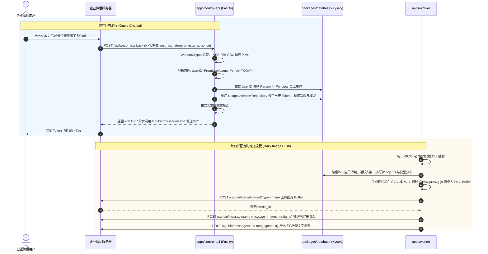

# Technical Design: 企业微信自建应用 Token 每日长图日报与实时交互查用量

## 1. 架构总览与交互拓扑

---

## 2. 关键技术实现规范

### 2.1 企业微信加解密协议 (`packages/provider-adapters/src/wecom-crypto.ts`)

- **签名验证**:
  - `hash = sha1(sort([token, timestamp, nonce, encrypt]).join(''))`
  - 比对 `hash === msg_signature`。
- **AES-256-CBC 解密**:
  - `aesKey = Buffer.from(encodingAesKey + '=', 'base64')` (32 字节)
  - `iv = aesKey.subarray(0, 16)`
  - 解密密文，去除 PKCS#7 Padding（末字节指示填充长度）；
  - 数据格式：`16 字节随机字符串 + 4 字节网络字节序长度 (uint32BE) + msgXml (明文字符串) + receiveId (CorpID)`。
- **纯原生实现**：采用 Node.js 原生 `node:crypto`，不依赖任何第三方 native npm 包。

### 2.2 意图识别与周期映射 (`apps/control-api/src/wecom/intent-parser.ts`)

| 用户口语表达关键词 | 解析周期 (`UsagePeriod`) | 统计半开区间 $[From, To)$ |
| :--- | :--- | :--- |
| `今天`, `今日`, `today`, `现在` | `TODAY` | 当日 00:00:00 至 当前时间 |
| `昨天`, `昨日`, `yesterday` | `YESTERDAY` | 昨日 00:00:00 至 昨日 23:59:59.999 |
| `上一周`, `上周`, `上个星期`, `last week` | `LAST_WEEK` | 上周一 00:00:00 至 上周日 23:59:59.999 |
| `本周`, `这周`, `这个星期`, `this week` | `WEEK` | 本周一 00:00:00 至 当前时间 |
| `本月`, `这个月`, `this month` | `MONTH` | 本月 1 日 00:00:00 至 当前时间 |
| `上个月`, `上月`, `last month` | `LAST_MONTH` | 上月 1 日 00:00:00 至 上月末 23:59:59.999 |

- **全员/个人修饰词**：若包含“全员”、“团队”、“全公司”且提问者拥有管理员身份，则查询全量数据；否则默认仅查询提问者本人绑定的 Principal。

### 2.3 数据聚合与长图渲染管道 (`apps/worker/src/reporting/`)

1. **数据源层**：
   - 优先复用 `packages/database` 中的 `UsageOverviewRepository`（支持小时/日桶与实时事实自动回退）；
   - 获取指标：总输入 Tokens、总输出 Tokens、总缓存 Tokens、总费用、总请求次数、Top 10 员工排行明细、模型份额比例。
2. **SVG 模板设计**：
   - 宽度固定为 800px，高度自适应；
   - 采用深蓝灰科技感渐变背景 `#0f172a -> #1e293b`；
   - 模块包括：
     - Header：企业名称、报表标题、统计周期与生成时间；
     - 4 宫格 KPI 卡片：总 Token、预估费用、调用请求数、活跃人数；
     - Top 10 个人榜单：名次徽标、姓名、部门、Token 消耗、水平渐变进度条；
     - 模型分布饼/条图与图例；
     - Footer 仟流智算水印与说明。
3. **PNG 渲染引擎**：
   - 使用 `@resvg/resvg-js` 的 `render(svgString).asPng()`，秒级生成高质量抗锯齿 PNG Buffer。
4. **企微上传与推送**：
   - 通过 `form-data` 发起 `POST https://qyapi.weixin.qq.com/cgi-bin/media/upload?access_token={token}&type=image`；
   - 获得 `media_id`（企微服务器保留 3 天）；
   - 推送图片消息至目标企微成员。

---

## 3. 环境变量与系统配置

| 环境变量 | 类型 | 必填 | 默认值 | 说明 |
| :--- | :--- | :--- | :--- | :--- |
| `WECOM_CALLBACK_TOKEN` | string | 是 | 无 | 企微后台“接收消息 API”中设置的 Token |
| `WECOM_CALLBACK_AES_KEY` | string | 是 | 无 | 企微后台“接收消息 API”中生成的 43 位 EncodingAESKey |
| `WECOM_DAILY_REPORT_RECIPIENTS`| string | 否 | 管理员列表 | 每日长图接收人企微 UserID，以英文逗号分隔 |
| `WECOM_DAILY_REPORT_CRON` | string | 否 | `0 9 * * *` | 每日日报定时推送时间（默认每天上午 09:00） |
