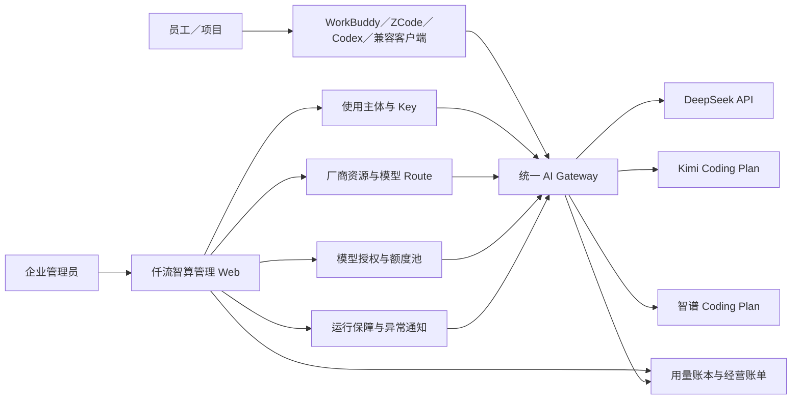
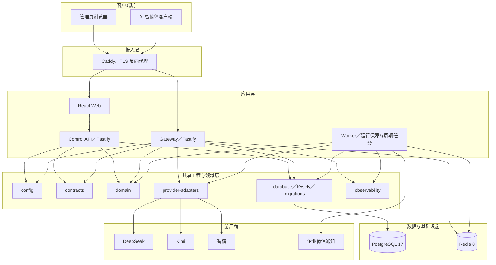
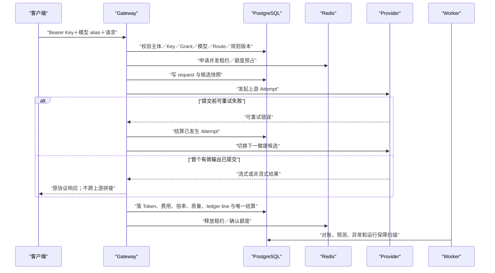
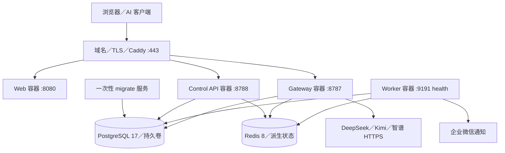

# 仟流智算 1.0 产品与技术架构（Final）

| 字段 | 内容 |
| --- | --- |
| 架构基线 | TRD v0.3＋当前代码＋数据库迁移 0044＋生产 Compose |
| 当前候选 | `origin/main@7ec225b`＋1.0 封板修订 |
| Review 状态 | `FINAL` |

## 1. 产品架构图

产品的中心不是“转发请求”，而是把主体、授权、资源、路由、额度、计量和经营结果闭成一条可追溯链。

## 2. 技术架构图

## 3. Gateway 请求与记账数据流

关键不变量：

1. Key、主体、授权或资源失效必须在访问上游前阻断。
2. 一个下游请求只有一个 settlement；每个实际消耗 Attempt 独立留痕。
3. 流式响应一旦提交，不切换上游、不拼接第二个响应。
4. 价格、倍率、路由和调度使用请求时点版本快照，历史不可被新规则改写。
5. 请求正文默认不落库；日志和 Evidence 不得出现 Key、Secret 或正文。

## 4. 部署架构图

### 4.1 生产边界

- PostgreSQL 和 Redis 只绑定本机／容器网络，不直接暴露公网。
- `migrate` 成功后业务服务才启动；当前最终迁移为 `0044`。
- Control API、Gateway、Web 和 Worker 分容器；故障域和扩缩容边界清晰。
- Caddy 统一终止 TLS 和路由；生产域名、证书和 Secret 由部署环境注入。
- Redis 保存可重建的并发／派生状态，PostgreSQL 保存业务事实和账本。

## 5. 领域边界

| 领域 | 主要对象 | 责任 |
| --- | --- | --- |
| 企业与身份 | enterprise、admin、session、principal | 企业边界、管理员认证、员工／项目主体 |
| 接入授权 | principal_key、grant、employee model rule | Key 生命周期、模型白名单、厂商池授权与额度 |
| 算力供给 | provider、resource、credential、unified model、route | 上游资源、凭证、模型发现、健康和路由候选 |
| 调用执行 | ai_request、route_candidate、upstream_attempt | 请求、候选、Affinity、有界切换和提交边界 |
| 计量经营 | usage_event、ledger_line、settlement、operating bill | Token、费用、套餐、员工账、项目账和结账 |
| 规则与调度 | billing rule、quota、forecast、dispatch policy | 计价、倍率、额度、预测、峰谷和节省证据 |
| 运行保障 | availability rule/event、alert、notification | 熔断、恢复、异常和人员通知 |

## 6. 安全边界

- 管理面使用管理员 Session；调用面使用主体 Bearer Key，两条认证链不混用。
- Key 使用摘要比对，Provider Secret 加密保存；明文只在受控入口短暂出现。
- Web 不直连数据库，不自行重算 Token、费用或账本。
- Provider Adapter 是上游协议与 Secret 的唯一出站边界。
- `observability` 只记录必要 metadata，并通过 canary 检查正文泄漏。
- 管理写操作必须有企业边界、并发版本、操作日志和必要的二次确认。

## 7. 与开发前架构的主要变化

1. `/v1/responses` 已从“默认拒绝”演进为 `TRANSFORMED`，但不是原生保真能力。
2. 模型别名从 `qianliu-*` 收敛为 `ql-*`。
3. 单人授权和批量授权统一为主体×厂商池配置，增加最终调用栅栏。
4. 数据库从初始迁移演进到 `0044`，补齐运行保障、额度窗口、经营账单和稳定模型身份。
5. 经营账单拆分月度总览、员工账、项目账、套餐分析、价值确认和结账管理。

## 8. R07 验证结论与边界

- Compose 与 Mac Mini 生产发布目录、应用镜像和服务健康已有 2026-08-10 Evidence；
- 数据库已生产升级到 `0044`，发布前备份已生成、校验并记录 Hash；完整隔离 restore 演练作为运维行动项保留；
- Caddy 公网 Gateway／管理 Web／Control API 路由已有 HTTP 200 生产证据；
- Responses 转换限制已写入 Final 产品说明书与 V1.4 复审报告；
- 运行保障 Worker、事件、通知 Outbox 和禁用通知的安全终态已有生产／隔离证据；真实企微成员到达不扩大为已完成。

结论：本图与当前代码、部署、迁移和已知生产事实一致，R07 `PASS_WITH_REGISTERED_OPERATION_BOUNDARY`。
