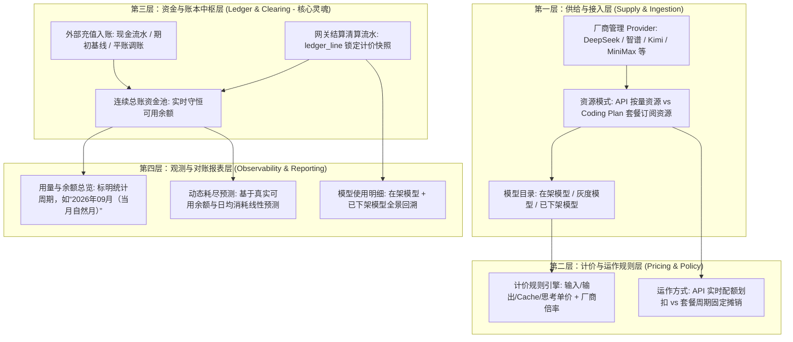

# 仟流智算平台 · 厂商资源中心定位、四大根本原则与功能全景架构

---

## 一、模块定位与核心价值

在“仟流智算”平台整体架构中：
- 调度与网关（Gateway）是处理请求与分发推理的“车间流水线”；
- **“厂商资源 / 厂商中心”是整座平台唯一的“原材料供应链底座与资金核算总基地”。**

平台的两项关键命脉在此处交汇：
1. **供给源头（原材料采购）**：所有外部大模型供应商（智谱 AI、DeepSeek、Moonshot/Kimi、MiniMax、OpenAI 等）与模型能力由此接入，统一管理可用形态、计价策略与路由生命周期；
2. **资金中枢（唯一花钱出口）**：**整个“仟流智算”所有花钱的地方都在这个模块**。外部真金白银的充值由此录入、调用产生的每一分 Token 成本由此划扣、包月套餐的周期摊销由此执行，是全局资金与成本的单一可信事实源（Single Source of Truth）。

---

## 二、四大根本原则

厂商资源中心的所有业务设计、数据模型、结算清算与前端报表，必须严格遵循以下四大根本原则：

```
┌─────────────────────────────────────────────────────────────────────────────┐
│                             厂商资源中心 · 四大根本原则                       │
├──────────────────────┬──────────────────────┬───────────────────────────────┤
│ 原则一：差异化精准算账 │ 原则二：真金白银严格守恒 │ 原则三：权责发生制 (事实至上)   │
│ (计费与数学基石)     │ (资金中枢与账本闭环) │ (模型状态与计费事实解耦)       │
├──────────────────────┴──────────────────────┴───────────────────────────────┤
│ 原则四：业技清晰分离 (财务闭环 vs 运维排障：0 Token 失败不污染财务账本)         │
└─────────────────────────────────────────────────────────────────────────────┘
```

### 原则一：差异化精准算账原则（计费基石 —— 核心防线）

> **“每一个大模型的 Token 费用都是不一样的，必须详细登记、精准计算、绝不能出错，否则整个账就全错了。”**

这是整套财务结算体系的数学基石。算账不准，整个资金大盘与对账体系皆为虚妄：

1. **模型维度严格区隔（模型不同，单价绝不混淆）**：
   - 每一款模型在供应商处的定价体系迥异。例如同属 DeepSeek，`Flash` 与 `Pro` 的输入/输出单价相差数倍；
   - 网关结算清算时，必须严格绑定实际承载该请求的具体底层模型（`actual_model`），**严禁使用统一模型的模糊均价，严禁跨模型套用单价**。
2. **Token 细分结构精确计量（严禁只记总数）**：
   - 单次请求严禁仅记单一的总 Token 数，必须分项计量：
     - **输入 Token（Input Tokens）**：按输入基础单价核算；
     - **输出 Token（Output Tokens）**：按生成单价核算；
     - **缓存命中 Token（Cache Hit Tokens）**：按厂商专属的低折扣单价（通常低至 1~2 折）核算；
     - **思维链 Token（Reasoning Tokens）**：深度思考推理过程产生的 Token 单独计量。
3. **计价规则“版本快照”永久锁定（防止调价搞乱历史账）**：
   - 供应商随时可能下调或调整模型价格；
   - 每一笔调用计入不可变账本（`ledger_line`）时，**必须将发生时刻生效的计价规则（单价、倍率、币种、规则版本）以快照形式永久固化在流水行内**。即使厂商日后调价 100 次，历史账本每一笔都可以原样复算核验。
4. **100% 数学可复核（严谨闭环）**：
   - 报表中的总花费绝非估算值，必须能通过底层单笔流水进行严格求和（$\sum \text{Tokens} \times \text{Snapshot Price}$）精准还原，账目精准到每一位小数。

---

### 原则二：真金白银与严格守恒原则（资金中枢）

> **“所有的花费都在这儿登记、在这儿体现。充值、扣费、账单实打实，进出平衡。”**

1. **统一花钱收口**：
   - 现金充值、授信入账、API 实时扣费、套餐订阅摊销，全部收口在厂商中心，杜绝任何账外流转。
2. **数学严格守恒**：
   $$\text{当前可用余额} = \text{期初基线} + \sum \text{累计充值} + \sum \text{对账调账} - \sum \text{历史至今所有真实 Token 消耗}$$
3. **连续流水总账模型（跨月自然连续平滑滚动）**：
   - “期初基线（`API_OPENING_BALANCE`）”仅在首次初始化或系统上线（Cutover）时设立一次；
   - 到了月末 24:00 进入次月 0:00，系统依赖连续总账自动平滑滚动，上月末结存自然作为下月起点，**无需每月人工补建基线，未来绝不因跨月产生数据断层**。

---

### 原则三：权责发生制（状态与事实解耦原则）

> **“下架是路由管理状态，计费是客观历史事实。产生消耗、产生花费，就必须入账。”**

1. **上下架状态与计费事实解耦**：
   - **下架（路由层状态）**：模型在平台被下线或取消挂载，仅代表“从下架此刻起不再接收新的推理请求”；
   - **计费（历史客观事实）**：在当期计费周期内（如自然月），该模型曾经产生过的调用、消耗的 Token 与费用，属于客观发生的事实，不可篡改、不可抹除。
2. **全口径账单呈现**：
   - 账单与明细报表严禁以“当前在架模型列表”作为过滤条件；
   - 已下架但当期产生过费用的模型，必须在明细报表中完整呈现，并明确打上**“已下架”**标签，确保**明细各项求和 100% 等于当月总花费**。

---

### 原则四：业技清晰分离原则（财务闭环 vs 运维排障）

> **“财务只认钱和 Token；技术排障留给异常中心。0 Token 失败绝不能污染财务对账。”**

1. **0 Token 失败直接确认为 0 成本**：
   - 请求因网络超时、连接重置或上游 500 报错在第一跳失败且未产生任何 Token（`input=0, output=0`）时，网关明确记录为 `CONFIRMED_ZERO_NO_UPSTREAM`，金额精确确认为 **¥0.00000000**；
   - 严禁将零消耗技术失败打上 `UNKNOWN_COST`（费用未知）标签，严禁触发“财务缺口”误报，绝不阻断财务余额结算与报表展示。
2. **技术排查归位异常中心**：
   - 调用为什么断开、上游为何报错、网络延迟与重试状态，完整沉淀在**异常中心**，由技术运维与 SRE 审计排查，不干扰业务与财务操作者。

---

## 三、厂商资源中心 · 四层功能全景架构



### 1. 供给与接入层（Supply & Ingestion）
- **厂商管理（Provider）**：维护各 AI 大模型上游厂商的基础信息、访问凭证与接口健康状态；
- **双轨资源模式（Resource Mode）**：
  - **API 按量模式**：基于预充值资金池实时扣减，随用随扣（如 DeepSeek）；
  - **Coding Plan 套餐模式**：按月/年订阅固定并发座席或额度包，按期管理有效窗口（如 Kimi 编程套餐）；
- **模型生命周期**：模型在平台具备“在架服务中”、“灰度中”、“已下架”三种状态，下架操作仅阻断新流，不破坏历史账本外键与数据关联。

### 2. 计价与运作规则层（Pricing & Policy）
- **多维规则配置引擎**：针对不同模型支持输入、输出、Cache 命中、思维链等多维度分项单价配置；
- **币种与倍率支持**：支持 CNY、USD 等多币种，支持面向企业/租户的结算倍率定义；
- **预检栅栏机制**：调用发起前进行余额底线检查与并发租约排队，避免超额无资透支。

### 3. 资金与账本中枢层（Ledger & Clearing —— 核心灵魂）
- **充值与资金流水（`provider_finance_event`）**：严格记录每一次线下打款、线上充值，生成不可修改的入账事实，维护全局资金池可用余额；
- **不可变账本明细（`ledger_line`）**：每一笔由网关执行完毕的 Attempt，只要发生上游交互，均沉淀不可篡改的账本行，并锁定当时的规则快照；
- **清算闭环机制**：
  - Token > 0：实时计算实际成本，记录 `PRICED_USAGE`，扣减资金池；
  - Token = 0：确认 `CONFIRMED_ZERO_NO_UPSTREAM`，成本为 0，账本秒级闭环。

### 4. 观测与对账报表层（Observability & Reporting）
- **明确的时间维度**：界面显式标明统计周期（例如“统计周期：2026年09月（当月自然月）”），避免时间口径歧义；
- **模型消耗全景明细**：
  - 展示所有发生费用的模型名称、调用笔数、Token 消耗量、折合费用；
  - 下架模型清晰标注“已下架”徽章，账目公开透明、无一遗漏；
- **动态科学预测**：以真实有效余额结合当月日均消耗速率，计算准确的“资源预计耗尽时间”，为企业充值决策提供真实支撑。

---

## 四、结语

本规范确立了**“算账必须精准、资金必须守恒、下架不可丢账、技术不可阻断”**的底层逻辑。研发、网关、数据库与前端呈现均以此规范为唯一准绳，共同保障千流智算平台资金链路的绝对严密、可信与稳健。
