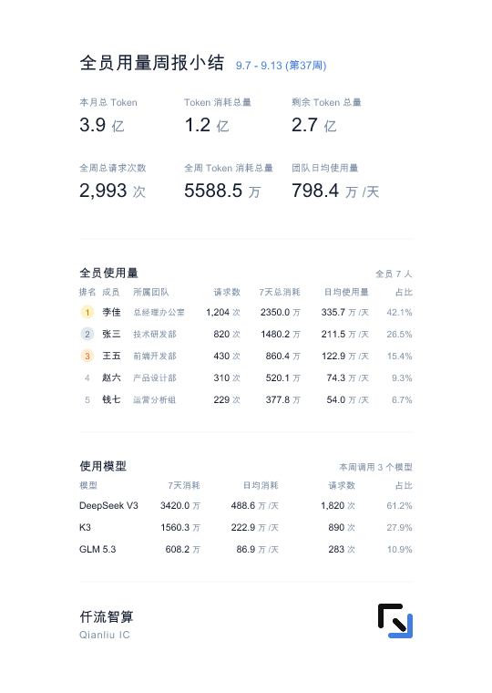

# 仟流智算 · 团队全员用量周报视觉与格式规范

**—— 企业微信团队全员用量周报（管理看板）推送标准**

> **版本**：v2.1（六大数字 2×3 双视角重构版：新增月度额度视角行）  
> **状态**：生产正式基线  
> **发布日期**：2026-09-14  
> **上位规范**：《仟流视觉法则 1.2》、《仟流智算 · 个人周报小结视觉与格式规范 v1.0》  
> **适用场景**：每周一早 09:00~09:29，通过企业微信自建应用向企业管理员（由环境变量 `WECOM_COMPANY_REPORT_RECIPIENTS` 配置指定，如企业负责人李佳）专属推送的长图管理看板。

---

## 🎯 01 / 产品定位与排版层级系统

全员周报推行严谨专业的**“五段自适应弹性排布 + 大数字放量 + 纯黑表格”**设计准则：

1. **六大核心大数字（2 行 × 3 列，双视角重构）**：
   - **第 1 行：月度额度视角**（让老板一眼掌握本月额度大盘）：
     1. `本月总 Token`（企业全部有效授权额度 `quota_value` 合计）；
     2. `Token 消耗总量`（本月累计真实 Token 消耗，账本口径）；
     3. `剩余 Token 总量`（本月总额度 − 已扣减额度，下限为 0）；
   - **第 2 行：本周用量视角**（保留 v2.0 三大数字）：
     4. `全周总请求次数`；5. `全周 Token 消耗总量`；6. `团队日均使用量`；
   - **排版规格**：两行等大并列，数值全量采用 **21px Bold 经典墨黑色（`#172033`）**，单位采用 **15px** 次级灰（`#7D8FA4`）；三列锚定 **X = 87 / 202 / 320**，行距 **72px**（单行槽位 46px + 行间呼吸 26px）；
   - **标题与数字开间**：标题至第 1 行大数字间距 **40px**，第一条分割线上下各保留 **26~28px** 对称呼吸间隙，视觉冲击力与呼吸感兼具。
2. **彻底解决“所属团队”与“请求数”重叠问题（零压字、无死区）**：
   - **“所属团队”字号精修**：采用精致清晰的 **`9.5px`**，即使团队名称长达 6~7 个汉字（如“总经理办公室”）也能完整呈现且不局促；
   - **后方 4 列坐标右移并弹性重配**：
     - `请求数`：右对齐锚点从原 242 右移至 **`X = 264`**（释放出 22px 关键缓冲，绝无重叠）；
     - `7天总消耗`：右对齐锚点从原 306 右移至 **`X = 330`**；
     - `日均使用量`：右对齐锚点从原 388 右移至 **`X = 405`**；
     - `占比`：右对齐锚点固定在 **`X = 453`**；
     - **视觉成果**：彻底抹平“日均使用量”与“占比”之间原先残留的 65px 空洞死区，右侧各数值列保持严谨平整的均匀呼吸微间距。
3. **五段式自适应纵向弹性排版（动态均分，告别底部空洞）**：
   - **固定安全外边距**：顶部严格保持 **`56px`**，底部严格保持 **`56px`**；
   - **画布整体高度**：锁定为 **`760px`**，移动端长宽比舒适协调；
   - **5 段统一 Flex 弹性分配**：
     - **Block 1**：顶栏标题与六大核心大数字（2 行 × 3 列，月度额度 + 本周用量双视角）；
     - **Divider 1**：动态居中分割线；
     - **Block 2**：全员使用量表格（动态根据实际在用人数 1~7 人计算真实高度）；
     - **Divider 2**：动态居中分割线；
     - **Block 3**：使用模型表格（动态根据模型数 1~3 计算真实高度）；
     - **Divider 3**：动态居中分割线；
     - **Block 4**：品牌底栏（仟流智算 + Qianliu IC + Logo）。
   - 无论实际在用员工是 4 人还是 7 人满编，卡片中间区域自动均分行距，3 条分割线精准居中，上下饱满自然，绝不再出现底部大片留白空洞！
4. **Token 计量单位统一标准（“万”与“亿”自适应）**：
   - 全盘 Token 计量统一以 **“万”**（保留 1 位小数，四舍五入）为基准；超大用量（$\ge 1$ 亿）自适应升格为 **“亿”**（如 `3.9 亿`），彻底废除无单位纯长数字。

---

## 🪙 02 / 字段与字号规范速查表

| 层次模块 | 字段内容 | 字号与字重 | 颜色 Hex | 说明 |
| :--- | :--- | :--- | :--- | :--- |
| **第 1 部分：标题区** | 主标题「全员用量周报小结」 | `24 px bold` | `#172033` | 顶层固定骨架 |
| | 统计周期标注「9.7 - 9.13」 | `13 px semibold` | `#417EE0` | 仟流蓝 |
| **第 2 部分：6个大数（2×3）** | 第 1 行：本月总 Token / Token 消耗总量 / 剩余 Token 总量（月度额度视角） | **`21 px bold` (数值) / `15 px` (单位)** | **`#172033` / `#7D8FA4`** | 三列锚定 X = 87 / 202 / 320 |
| | 第 2 行：全周总请求次数 / 全周 Token 消耗总量 / 团队日均使用量（本周用量视角） | **`21 px bold` (数值) / `15 px` (单位)** | **`#172033` / `#7D8FA4`** | 行距 72px，与第 1 行等大并列 |
| | 标签说明文字 | `12 px medium` | `#7D8FA4` | 次级辅助灰 |
| **第 3 部分：全员使用量** | 模块小标题「全员使用量」 | `14 px bold` | `#172033` | 纯黑加粗 |
| | 成员姓名（李佳、张三...） | **`11 px bold`** | `#172033` | 经典墨黑加粗 |
| | 所属团队（总经理办公室...） | **`9.5 px medium`** | `#7D8FA4` | **优化至 9.5px，6~7字绝不压字** |
| | 请求数 | **`11 px bold`** | `#172033` | **锚定 X = 264** (右对齐) |
| | 7天总消耗 | **`11 px bold`** | `#172033` | **锚定 X = 330** (右对齐) |
| | 日均使用量 | **`11 px bold`** | **`#172033`** | **锚定 X = 405** (纯黑加粗) |
| | 占比 | `11 px medium` | `#7D8FA4` | **锚定 X = 453** (死区消除) |
| **第 4 部分：使用模型** | 模块小标题「使用模型」 | `14 px bold` | `#172033` | 纯黑加粗 |
| | 模型名（DeepSeek V3 / K3...） | **`11 px bold`** | `#172033` | 精确模型代号加粗 |
| | 7天消耗 | **`11 px bold`** | `#172033` | 经典墨黑加粗 |
| | 日均消耗 | **`11 px bold`** | **`#172033`** | **纯黑墨黑加粗** |
| | 请求数 | **`11 px bold`** | `#172033` | 纯数字墨黑加粗 |
| | 占比 | `11 px medium` | `#7D8FA4` | 次级灰 |
| **第 5 部分：品牌底栏** | 仟流智算 / Qianliu IC | `15 px bold` / `11 px` | `#172033` / `#7D8FA4` | 左对齐固定基线 |
| | 官方矢量 Logo | **`38 × 38 px`** | 原生黑蓝角标 | 右侧锚定 X=453，**蓝角最下沿严格与 Qianliu IC 最下端处于同一水平线** |

---

## 📐 03 / 画布几何参数与安全区域

| 维度 | 参数 | 像素值 | 说明 |
| :--- | :--- | :--- | :--- |
| **画布导出尺寸** | 宽 × 高 | `540 × 760 px` | 移动端最佳查阅比例 |
| **画布 viewBox** | 视图区域 | `44 56 452 760` | 上下 56px 固定安全边距，视觉端正沉稳 |
| **画布背景色** | 底色 | `#FFFFFF` | 纯白长图（移除外围阴影与衬底） |
| **大数字下移** | Title to KPI | `40 px` | 与顶栏拉开空间呼吸 |
| **大数字行距** | KPI Row Step | `72 px` | 两行六宫格（单行槽位 46px + 行间呼吸 26px） |
| **分割线留白** | Divider Margin | `26~28 px` | 上下对称分布 |
| **Logo 水平对齐** | 蓝角基线 | 与 Qianliu IC 对齐 | **Logo 右下蓝色括弧最底边缘与英文字样 Baseline 严格处于同一水平线** |

### 视觉渲染效果图（v2.1 2×3 六大数字双视角长图）

---

## 💻 04 / 定向推送与调度逻辑

- **下发时间**：每周一早 `09:00 ~ 09:29`（严格限定在晨间窗口，超时绝不补发）；
- **接收人指定**：通过环境变量 `WECOM_COMPANY_REPORT_RECIPIENTS` 配置指定企业负责人的企微 UserID（如李佳）；
- **Redis 持久化防重**：写入键 `scheduler:weekly_report:{enterprise_id}:{date}`，容器重启亦能保持防重记忆。
